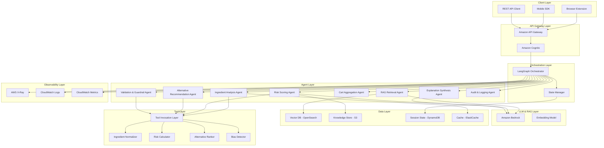
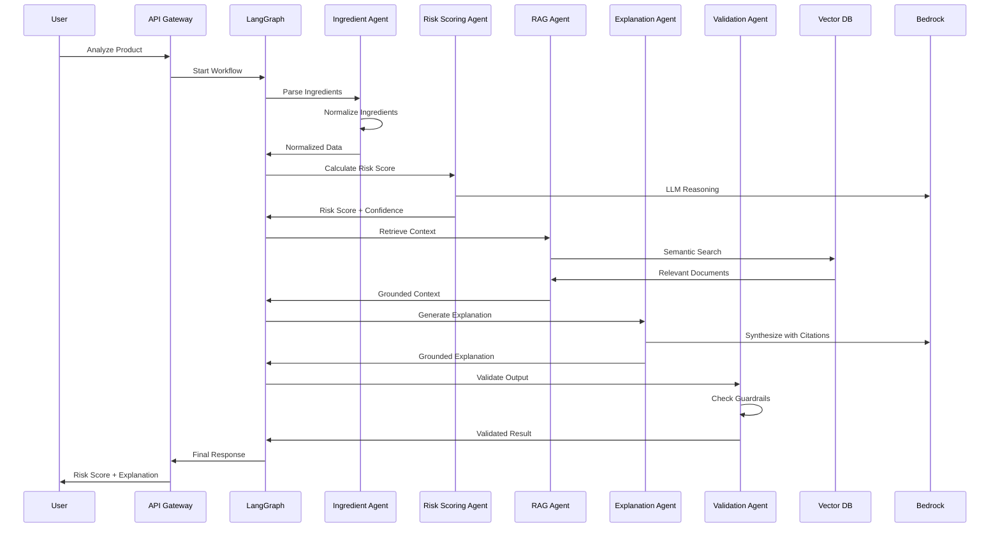
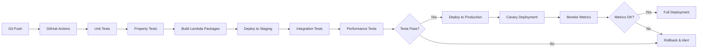

# Design Document: SwasthCart AI

## Overview

SwasthCart AI is a production-ready preventive health intelligence system that integrates with grocery and quick-commerce platforms (e.g., Amazon, Flipkart, BigBasket, Blinkit, Instamart). The system employs a stateful agentic architecture orchestrated by LangGraph, utilizing specialized AI agents, large language models, and retrieval-augmented generation to provide personalized, explainable health risk analysis.

### Core Design Principles

1. **Stateful Agentic Architecture**: Multi-agent system with centralized orchestration
2. **Trust-First Design**: Transparent scoring, source citations, confidence metrics, user control
3. **Safety by Design**: Comprehensive guardrails, no medical diagnosis, clear disclaimers
4. **Production Readiness**: Scalable AWS infrastructure, comprehensive observability, graceful degradation
5. **Data Minimization**: No PHI, no medical records, public datasets only
6. **Responsible AI**: Bias detection, explainability, audit trails, model governance

### System Boundaries

**In Scope:**
- Product risk scoring based on ingredients and nutrition
- Cart-level health assessment
- RAG-grounded explanations with citations
- Alternative product recommendations
- Individual and Family mode scoring
- Browser extension, Mobile SDK, REST API deployment

**Out of Scope:**
- Medical diagnosis or treatment recommendations
- Access to medical records or PHI
- Real-time biometric integration
- Prescription drug interactions
- Clinical decision support

### Deployment Models

1. **Browser Extension (MVP)**: Injects UI overlay into grocery platform pages
2. **Mobile SDK**: Native components for iOS/Android partner integration
3. **REST API**: Enterprise integration for platform backends

## Architecture

### High-Level Architecture



### Architecture Layers

#### 1. Client Layer
- **Browser Extension**: Chrome/Firefox extension injecting UI into grocery sites
- **Mobile SDK**: React Native SDK for iOS/Android integration
- **REST API Client**: HTTP client for enterprise backend integration

#### 2. API Gateway Layer
- **Amazon API Gateway**: REST API endpoints with request validation, throttling, CORS
- **Amazon Cognito**: User authentication, JWT token validation, user pool management

#### 3. Orchestration Layer (LangGraph)
- **LangGraph Orchestrator**: Stateful workflow engine managing agent execution
- **State Manager**: Session state persistence, workflow checkpoints, rollback capability
- **Workflow Definitions**: Declarative agent graphs for different analysis types

#### 4. Agent Layer
Eight specialized agents with defined input/output schemas:
- **Ingredient Analysis Agent**: Parse and normalize ingredient lists
- **Risk Scoring Agent**: Calculate personalized health risk scores
- **RAG Retrieval Agent**: Semantic search in vector database
- **Explanation Synthesis Agent**: Generate grounded explanations
- **Cart Aggregation Agent**: Compute cart-level health scores
- **Alternative Recommendation Agent**: Identify safer alternatives
- **Validation & Guardrail Agent**: Enforce safety constraints
- **Audit & Logging Agent**: Maintain compliance logs

#### 5. LLM & RAG Layer
- **Amazon Bedrock**: Claude 3 for reasoning, structured output generation
- **Embedding Model**: Amazon Titan Embeddings for vector generation

#### 6. Data Layer
- **Vector Database (OpenSearch)**: Embeddings of WHO, FSSAI, USDA guidelines
- **Knowledge Store (S3)**: Structured datasets, risk mappings, sensitivity matrices
- **Session State (DynamoDB)**: User profiles, workflow state, analysis history
- **Cache (ElastiCache)**: Frequently analyzed products, computed risk scores

#### 7. Tool Invocation Layer
- **LangChain + MCP Framework**: Dynamic tool invocation for agents
- **Ingredient Normalizer**: Canonical ingredient name mapping
- **Risk Calculator**: Rule-based risk computation engine
- **Alternative Ranker**: Product similarity and ranking logic
- **Bias Detector**: Brand and price bias detection

#### 8. Observability Layer
- **AWS X-Ray**: Distributed tracing across agents and services
- **CloudWatch Logs**: Structured logging with agent decision paths
- **CloudWatch Metrics**: KPI tracking, performance monitoring, alerting

### Data Flow: Product Risk Analysis



## Components and Interfaces

### 1. LangGraph Orchestration Layer

#### Orchestrator Component

**Responsibilities:**
- Manage stateful multi-step workflows
- Coordinate agent execution order
- Handle retries and fallbacks
- Enforce guardrails at transition points
- Maintain audit trail

**State Schema:**
```json
{
  "session_id": "string",
  "user_id": "string",
  "workflow_type": "product_analysis | cart_analysis",
  "current_step": "string",
  "user_profile": {
    "health_conditions": ["string"],
    "mode": "individual | family",
    "family_profiles": [{"member_id": "string", "conditions": ["string"]}]
  },
  "product_data": {
    "product_id": "string",
    "ingredients": ["string"],
    "nutrition": {}
  },
  "intermediate_results": {},
  "final_output": {},
  "metadata": {
    "start_time": "timestamp",
    "agent_execution_times": {}
  }
}
```

**Workflow Definition (Product Analysis):**
```python
# Pseudocode for LangGraph workflow
workflow = StateGraph()

workflow.add_node("ingredient_analysis", ingredient_analysis_agent)
workflow.add_node("risk_scoring", risk_scoring_agent)
workflow.add_node("rag_retrieval", rag_retrieval_agent)
workflow.add_node("explanation_synthesis", explanation_synthesis_agent)
workflow.add_node("validation", validation_guardrail_agent)
workflow.add_node("audit_logging", audit_logging_agent)

workflow.add_edge("ingredient_analysis", "risk_scoring")
workflow.add_edge("risk_scoring", "rag_retrieval")
workflow.add_edge("rag_retrieval", "explanation_synthesis")
workflow.add_edge("explanation_synthesis", "validation")
workflow.add_edge("validation", "audit_logging")

workflow.set_entry_point("ingredient_analysis")
workflow.set_finish_point("audit_logging")
```

**Retry Strategy:**
- Exponential backoff: 1s, 2s, 4s
- Max retries: 3
- Fallback to rule-based engine if LLM fails

**Interface:**
```python
class LangGraphOrchestrator:
    def execute_workflow(
        self,
        workflow_type: str,
        input_data: dict,
        user_profile: dict
    ) -> dict:
        """
        Execute stateful workflow with agent coordination.
        
        Returns:
            {
                "status": "success | partial | error",
                "result": {},
                "confidence": float,
                "execution_time_ms": int,
                "trace_id": str
            }
        """
        pass
```

### 2. Ingredient Analysis Agent

**Responsibilities:**
- Parse ingredient lists from product metadata
- Normalize ingredient names to canonical forms
- Identify additives, preservatives, artificial ingredients
- Extract nutritional values
- Classify ultra-processed status

**Input Schema:**
```json
{
  "product_id": "string",
  "raw_ingredients": "string",
  "nutrition_facts": {
    "calories": "number",
    "total_fat_g": "number",
    "saturated_fat_g": "number",
    "trans_fat_g": "number",
    "cholesterol_mg": "number",
    "sodium_mg": "number",
    "total_carbs_g": "number",
    "dietary_fiber_g": "number",
    "total_sugars_g": "number",
    "added_sugars_g": "number",
    "protein_g": "number"
  },
  "serving_size": "string"
}
```

**Output Schema:**
```json
{
  "normalized_ingredients": [
    {
      "name": "string",
      "canonical_name": "string",
      "category": "additive | preservative | artificial | natural",
      "e_number": "string | null",
      "confidence": "float"
    }
  ],
  "nutrition_normalized": {},
  "ultra_processed_score": "float (0-1)",
  "parsing_confidence": "float",
  "warnings": ["string"]
}
```

**Tool Invocations:**
- `ingredient_normalizer.normalize(ingredient_name)`: Map to canonical form
- `additive_classifier.classify(ingredient)`: Identify additive type
- `ultra_processed_classifier.score(ingredients, nutrition)`: Compute UPF score

**Implementation Logic:**
1. Tokenize ingredient string by commas and parentheses
2. For each ingredient, query normalization tool
3. Classify ingredient category (additive, preservative, etc.)
4. Extract E-numbers if present
5. Compute ultra-processed score based on NOVA classification
6. Return structured output with confidence scores

### 3. Risk Scoring Agent

**Responsibilities:**
- Calculate personalized health risk scores
- Weight ingredients by user health conditions
- Compute confidence scores
- Support Individual and Family modes

**Input Schema:**
```json
{
  "normalized_ingredients": [],
  "nutrition_normalized": {},
  "ultra_processed_score": "float",
  "user_profile": {
    "health_conditions": ["diabetes", "hypertension"],
    "mode": "individual | family",
    "family_profiles": []
  }
}
```

**Output Schema:**
```json
{
  "risk_score": "float (0-100)",
  "confidence_score": "float (0-1)",
  "risk_factors": [
    {
      "factor": "high_sodium",
      "severity": "high | medium | low",
      "contribution": "float (0-1)"
    }
  ],
  "mode": "individual | family",
  "family_scores": [
    {"member_id": "string", "risk_score": "float"}
  ]
}
```

**Tool Invocations:**
- `risk_calculator.compute_base_risk(ingredients, nutrition)`: Rule-based baseline
- `condition_sensitivity_lookup.query(condition, ingredient)`: Get sensitivity weight
- `confidence_estimator.estimate(data_completeness, model_uncertainty)`: Compute confidence

**Implementation Logic:**
1. Query condition-sensitivity matrix from Knowledge Store
2. For each ingredient, compute weighted risk based on user conditions
3. Aggregate nutritional risk factors (high sodium, high sugar, etc.)
4. Apply ultra-processed penalty
5. If Family mode, compute per-member scores and aggregate
6. Use LLM for complex reasoning if confidence threshold met, else rule-based
7. Compute confidence score based on data completeness
8. Return structured risk assessment

**LLM Prompt Template:**
```
You are a health risk assessment agent. Given the following product data and user health profile, calculate a personalized risk score.

Product Data:
- Ingredients: {ingredients}
- Nutrition: {nutrition}
- Ultra-processed score: {upf_score}

User Profile:
- Health Conditions: {conditions}

Condition Sensitivity Data:
{sensitivity_matrix}

Calculate a risk score (0-100) where:
- 0-30: Low risk
- 31-60: Medium risk
- 61-100: High risk

Return JSON:
{
  "risk_score": <number>,
  "reasoning": "<brief explanation>",
  "key_risk_factors": ["<factor1>", "<factor2>"]
}
```

### 4. RAG Retrieval Agent

**Responsibilities:**
- Perform semantic search in vector database
- Retrieve relevant health guidelines and research
- Compute retrieval confidence scores
- Filter by health condition metadata

**Input Schema:**
```json
{
  "query": "string",
  "health_conditions": ["string"],
  "top_k": "int",
  "filters": {
    "source": ["WHO", "FSSAI", "USDA"],
    "document_type": ["guideline", "research", "labeling_rule"]
  }
}
```

**Output Schema:**
```json
{
  "retrieved_documents": [
    {
      "document_id": "string",
      "content": "string",
      "source": "string",
      "relevance_score": "float",
      "metadata": {}
    }
  ],
  "retrieval_confidence": "float",
  "query_embedding": "array"
}
```

**Tool Invocations:**
- `embedding_model.embed(query)`: Generate query embedding
- `vector_db.similarity_search(embedding, filters, top_k)`: Retrieve documents

**Implementation Logic:**
1. Generate query embedding using Amazon Titan Embeddings
2. Construct OpenSearch query with metadata filters
3. Execute semantic similarity search
4. Rank results by relevance score
5. Compute retrieval confidence based on top result scores
6. Return top-k documents with metadata

**Vector Database Schema (OpenSearch):**
```json
{
  "document_id": "string",
  "content": "string",
  "embedding": "dense_vector (1536 dimensions)",
  "metadata": {
    "source": "WHO | FSSAI | USDA | OpenFoodFacts",
    "document_type": "guideline | research | labeling_rule",
    "health_conditions": ["diabetes", "hypertension"],
    "nutrients": ["sodium", "sugar"],
    "publication_date": "date",
    "citation": "string"
  }
}
```

### 5. Explanation Synthesis Agent

**Responsibilities:**
- Generate human-readable explanations
- Ground explanations in retrieved documents
- Include source citations
- Avoid medical diagnostic language
- Support multi-language output

**Input Schema:**
```json
{
  "risk_score": "float",
  "risk_factors": [],
  "retrieved_documents": [],
  "user_language": "en | hi"
}
```

**Output Schema:**
```json
{
  "explanation": "string",
  "citations": [
    {
      "source": "string",
      "snippet": "string",
      "url": "string"
    }
  ],
  "confidence": "float",
  "language": "string"
}
```

**Tool Invocations:**
- `citation_extractor.extract(document, risk_factor)`: Extract relevant snippets

**Implementation Logic:**
1. Construct prompt with risk factors and retrieved documents
2. Invoke Bedrock LLM with structured output schema
3. Extract citations from generated explanation
4. Validate that explanation is grounded in retrieved documents
5. Translate if user language is not English
6. Return explanation with citations

**LLM Prompt Template:**
```
You are a health explanation agent. Generate a clear, user-friendly explanation for why this product received the given risk score.

Risk Score: {risk_score}/100
Key Risk Factors: {risk_factors}

Reference Documents:
{retrieved_documents}

Guidelines:
- Use simple, non-technical language
- Ground all claims in the reference documents
- Include specific citations
- Avoid medical diagnostic language
- Do not recommend medical treatment
- Focus on ingredient and nutritional concerns

Generate explanation in {language}.

Return JSON:
{
  "explanation": "<explanation text>",
  "citations": [{"source": "<source>", "snippet": "<relevant quote>"}]
}
```

### 6. Cart Aggregation Agent

**Responsibilities:**
- Compute cart-level health score
- Identify high-risk items
- Weight by quantity and serving size
- Track improvement trends

**Input Schema:**
```json
{
  "cart_items": [
    {
      "product_id": "string",
      "risk_score": "float",
      "quantity": "int",
      "serving_size": "string",
      "category": "string"
    }
  ],
  "previous_cart_score": "float | null"
}
```

**Output Schema:**
```json
{
  "cart_health_score": "float (0-100)",
  "high_risk_items": [
    {
      "product_id": "string",
      "risk_score": "float",
      "contribution_to_cart_risk": "float"
    }
  ],
  "trend": "improving | declining | stable",
  "category_breakdown": {
    "snacks": "float",
    "beverages": "float",
    "packaged_foods": "float"
  }
}
```

**Implementation Logic:**
1. Normalize quantities to standard serving sizes
2. Compute weighted average risk score
3. Identify items contributing >15% to total cart risk
4. Compare with previous cart score if available
5. Compute per-category risk breakdown
6. Return aggregated assessment

### 7. Alternative Recommendation Agent

**Responsibilities:**
- Identify safer product alternatives
- Rank by health score improvement
- Consider category, price, availability
- Avoid brand bias

**Input Schema:**
```json
{
  "product_id": "string",
  "risk_score": "float",
  "category": "string",
  "price_range": "string",
  "user_profile": {}
}
```

**Output Schema:**
```json
{
  "alternatives": [
    {
      "product_id": "string",
      "product_name": "string",
      "risk_score": "float",
      "risk_improvement": "float",
      "price_difference": "float",
      "availability": "in_stock | out_of_stock",
      "similarity_score": "float"
    }
  ],
  "bias_check_passed": "boolean"
}
```

**Tool Invocations:**
- `alternative_ranker.rank(product, candidates, user_profile)`: Rank alternatives
- `bias_detector.check(alternatives)`: Detect brand/price bias

**Implementation Logic:**
1. Query product database for same category items
2. Filter by price range (±30% of original)
3. Compute risk scores for candidates
4. Rank by risk improvement and similarity
5. Run bias detection on top-5 alternatives
6. If bias detected, re-rank with bias mitigation
7. Return top-5 alternatives

### 8. Validation & Guardrail Agent

**Responsibilities:**
- Validate agent outputs against safety constraints
- Suppress medical diagnostic claims
- Filter toxic content
- Apply deterministic overrides for unsafe outputs
- Log guardrail trigger events

**Input Schema:**
```json
{
  "agent_output": {},
  "agent_type": "string",
  "validation_rules": ["no_diagnosis", "no_treatment", "no_toxicity"]
}
```

**Output Schema:**
```json
{
  "validation_passed": "boolean",
  "violations": [
    {
      "rule": "string",
      "severity": "critical | warning",
      "message": "string"
    }
  ],
  "sanitized_output": {}
}
```

**Validation Rules:**
1. **No Medical Diagnosis**: Reject outputs containing "diagnose", "disease", "cure", "treat"
2. **No Treatment Recommendations**: Reject outputs recommending medications or therapies
3. **No Toxicity**: Filter offensive, discriminatory, or harmful language
4. **Confidence Threshold**: Flag outputs with confidence <0.5
5. **Citation Requirement**: Ensure explanations include source citations
6. **Disclaimer Presence**: Verify medical disclaimer is included

**Implementation Logic:**
1. Parse agent output
2. Apply regex and keyword filters for prohibited terms
3. Check confidence scores against thresholds
4. Validate citation presence for explanations
5. If critical violation, apply deterministic override (generic safe message)
6. Log all violations to audit trail
7. Return validation result

### 9. Audit & Logging Agent

**Responsibilities:**
- Maintain immutable audit logs
- Log all risk assessments with inputs
- Log RAG retrievals with sources
- Log guardrail trigger events
- Provide audit query interface

**Input Schema:**
```json
{
  "event_type": "risk_assessment | rag_retrieval | guardrail_trigger | alternative_recommendation",
  "session_id": "string",
  "user_id": "string",
  "timestamp": "string",
  "data": {}
}
```

**Output Schema:**
```json
{
  "log_id": "string",
  "status": "logged | failed"
}
```

**Audit Log Schema (DynamoDB):**
```json
{
  "log_id": "string (UUID)",
  "session_id": "string",
  "user_id": "string",
  "timestamp": "string (ISO 8601)",
  "event_type": "string",
  "agent": "string",
  "input_data": {},
  "output_data": {},
  "execution_time_ms": "int",
  "trace_id": "string",
  "metadata": {}
}
```

**Implementation Logic:**
1. Generate unique log_id
2. Serialize event data
3. Write to DynamoDB with TTL (1 year)
4. Write to CloudWatch Logs for searchability
5. Emit CloudWatch metric for event type
6. Return log confirmation

## Data Models

### User Profile Model

```json
{
  "user_id": "string (UUID)",
  "created_at": "timestamp",
  "updated_at": "timestamp",
  "preferences": {
    "mode": "individual | family",
    "language": "en | hi",
    "swasth_mode_enabled": "boolean"
  },
  "health_profile": {
    "conditions": [
      {
        "condition_id": "string",
        "condition_name": "diabetes | pre-diabetes | hypertension | thyroid | pcos | cardiovascular | mental_health",
        "declared_at": "timestamp"
      }
    ]
  },
  "family_profiles": [
    {
      "member_id": "string (UUID)",
      "relationship": "string",
      "conditions": ["string"]
    }
  ],
  "privacy": {
    "data_retention_days": "int",
    "audit_log_access": "boolean"
  }
}
```

### Product Model

```json
{
  "product_id": "string",
  "platform": "string",
  "name": "string",
  "brand": "string",
  "category": "string",
  "raw_ingredients": "string",
  "nutrition_facts": {},
  "serving_size": "string",
  "price": "float",
  "availability": "in_stock | out_of_stock",
  "metadata": {
    "barcode": "string",
    "image_url": "string",
    "last_updated": "timestamp"
  }
}
```

### Risk Assessment Model

```json
{
  "assessment_id": "string (UUID)",
  "session_id": "string",
  "user_id": "string",
  "product_id": "string",
  "timestamp": "timestamp",
  "risk_score": "float (0-100)",
  "confidence_score": "float (0-1)",
  "mode": "individual | family",
  "risk_factors": [
    {
      "factor": "string",
      "severity": "high | medium | low",
      "contribution": "float"
    }
  ],
  "explanation": {
    "text": "string",
    "citations": []
  },
  "alternatives": [],
  "metadata": {
    "execution_time_ms": "int",
    "trace_id": "string",
    "model_version": "string"
  }
}
```

### Cart Assessment Model

```json
{
  "cart_id": "string (UUID)",
  "user_id": "string",
  "timestamp": "timestamp",
  "cart_health_score": "float (0-100)",
  "items": [
    {
      "product_id": "string",
      "risk_score": "float",
      "quantity": "int"
    }
  ],
  "high_risk_items": [],
  "trend": "improving | declining | stable",
  "previous_cart_score": "float | null"
}
```

### Knowledge Store Models

**Condition-Sensitivity Matrix:**
```json
{
  "condition": "diabetes",
  "sensitivities": [
    {
      "ingredient_canonical": "added_sugar",
      "sensitivity_weight": "float (0-1)",
      "evidence_level": "high | medium | low",
      "sources": ["WHO_guideline_2015", "FSSAI_standard_2020"]
    }
  ]
}
```

**Ingredient Risk Mapping:**
```json
{
  "ingredient_canonical": "sodium_benzoate",
  "risk_category": "preservative",
  "e_number": "E211",
  "base_risk_score": "float (0-100)",
  "condition_modifiers": {
    "hypertension": "float (multiplier)"
  },
  "sources": ["FSSAI_additive_list", "EFSA_opinion_2016"]
}
```

**Ultra-Processed Classification:**
```json
{
  "nova_group": "4",
  "indicators": [
    "contains_artificial_sweeteners",
    "contains_emulsifiers",
    "contains_flavor_enhancers",
    "high_ingredient_count"
  ],
  "risk_penalty": "float (0-30)"
}
```


## Correctness Properties

*A property is a characteristic or behavior that should hold true across all valid executions of a system—essentially, a formal statement about what the system should do. Properties serve as the bridge between human-readable specifications and machine-verifiable correctness guarantees.*

### Property 1: Session State Persistence Across Agent Interactions

*For any* analysis workflow with multiple agent invocations, the session state maintained by the Orchestration_Layer should remain consistent and accessible to all agents throughout the workflow execution.

**Validates: Requirements 1.2**

### Property 2: Workflow Transition Ordering

*For any* defined workflow graph, agents should be invoked in the order specified by the workflow definition, with no agent executing before its predecessors complete.

**Validates: Requirements 1.3**

### Property 3: Exponential Backoff Retry Pattern

*For any* agent operation that fails, retry attempts should follow exponential backoff timing (1s, 2s, 4s) up to the maximum retry limit.

**Validates: Requirements 1.4**

### Property 4: Guardrail Enforcement at Transitions

*For any* workflow transition between agents, the Orchestration_Layer should invoke guardrail validation before proceeding to the next agent.

**Validates: Requirements 1.6**

### Property 5: Audit Trail Completeness

*For any* workflow execution, all agent invocations, state transitions, tool calls, RAG retrievals, risk assessments, and guardrail triggers should be logged to the audit trail with complete metadata.

**Validates: Requirements 1.7, 8.3, 8.4, 8.5, 8.6, 8.7, 8.8, 29.1, 29.2, 29.3, 29.4**

### Property 6: Agent Input/Output Schema Compliance

*For any* agent invocation, the input provided should conform to the agent's defined input JSON schema, and the output returned should conform to the agent's defined output JSON schema.

**Validates: Requirements 2.10, 2.11, 3.2**

### Property 7: Tool Invocation Capability

*For any* agent that requires tool access, the agent should be able to successfully invoke tools through the Tool_Invocation_Layer and receive results.

**Validates: Requirements 2.13**

### Property 8: Medical Diagnostic Claim Suppression

*For any* LLM-generated output (risk explanations, alternative recommendations, or any user-facing text), the output should not contain medical diagnostic language such as "diagnose", "disease", "cure", "treat", or similar clinical terminology.

**Validates: Requirements 3.6, 9.3, 14.6**

### Property 9: Explanation Grounding in Retrieved Documents

*For any* generated explanation, all factual claims should be traceable to specific retrieved documents from the Vector_Database, with no hallucinated information.

**Validates: Requirements 4.2, 4.5**

### Property 10: Citation Presence in Explanations

*For any* generated explanation, the output should include citation snippets from authoritative source documents with proper attribution.

**Validates: Requirements 4.3, 14.4**

### Property 11: Retrieval Confidence Score Validity

*For any* RAG retrieval operation, the returned confidence score should be a float in the range [0, 1] and should reflect the relevance quality of retrieved documents.

**Validates: Requirements 4.4**

### Property 12: Vector Database Metadata Filtering

*For any* semantic search query with metadata filters (health condition, source, document type), the returned documents should match all specified filter criteria.

**Validates: Requirements 5.3**

### Property 13: PHI and Medical Record Rejection

*For any* input data containing Protected Health Information (PHI) or medical record identifiers, the system should reject the input and return an error without storing the data.

**Validates: Requirements 5.9, 19.1, 19.2**

### Property 14: Synthetic Data Isolation

*For any* user-facing output, the result should never contain data marked as synthetic or generated by the Synthetic_Scenario_Engine.

**Validates: Requirements 7.5**

### Property 15: Prompt Injection Protection

*For any* user input or product metadata containing prompt injection patterns (e.g., "ignore previous instructions", "system:", role manipulation), the Guardrails_Layer should detect and neutralize the injection attempt.

**Validates: Requirements 9.1**

### Property 16: Output Safety Validation

*For any* agent output, the Validation_Guardrail_Agent should validate the output against all safety constraints before the output is returned to the user.

**Validates: Requirements 9.2**

### Property 17: Toxic Content Filtering

*For any* generated text output, content containing toxic, offensive, or discriminatory language should be filtered and replaced with safe alternatives.

**Validates: Requirements 9.4**

### Property 18: Guardrail Trigger Logging

*For any* guardrail violation detected, the event should be logged with violation type, severity, and context for audit purposes.

**Validates: Requirements 9.6, 25.6**

### Property 19: Medical Disclaimer Presence

*For any* health-related output (risk scores, explanations, recommendations), the response should include a medical disclaimer stating the system is not a diagnostic tool and not a replacement for medical advice.

**Validates: Requirements 9.7, 14.7**

### Property 20: Risk Score Generation

*For any* product with valid ingredient and nutrition data, the Risk_Scoring_Agent should generate a Product_Risk_Score in the range [0, 100] with an associated Confidence_Score.

**Validates: Requirements 12.1, 12.6, 24.1**

### Property 21: Risk Score Personalization

*For any* two users with different health condition profiles analyzing the same product, the generated Product_Risk_Scores should differ if the product contains ingredients relevant to their conditions.

**Validates: Requirements 12.2**

### Property 22: Multi-Factor Risk Scoring

*For any* product risk assessment, the Risk_Score should be influenced by changes to ingredient composition, nutritional values, or ultra-processed classification, demonstrating that all factors are considered.

**Validates: Requirements 12.3**

### Property 23: Cart Health Score Aggregation

*For any* shopping cart, the Cart_Health_Score should be mathematically derivable from the individual Product_Risk_Scores of items in the cart, weighted by quantity and serving size.

**Validates: Requirements 13.1, 13.2, 13.3**

### Property 24: High-Risk Item Identification

*For any* shopping cart with items of varying risk scores, the items identified as "high-risk" should be those contributing the most to the overall cart risk (e.g., top 20% contributors).

**Validates: Requirements 13.4**

### Property 25: Explanation Generation with Risk Factor References

*For any* product risk assessment, the generated explanation should explicitly reference the specific ingredients or nutritional factors that contributed to the risk score.

**Validates: Requirements 14.2, 14.3**

### Property 26: Confidence Score Inclusion in Explanations

*For any* generated explanation, the output should include the Confidence_Score indicating the reliability of the assessment.

**Validates: Requirements 14.5**

### Property 27: Alternative Recommendation Generation

*For any* product identified as high-risk (score > 60), the Alternative_Recommendation_Agent should return at least one safer alternative with a lower risk score, if alternatives exist in the same category.

**Validates: Requirements 15.1**

### Property 28: Alternative Ranking by Health Improvement

*For any* set of alternative recommendations, the alternatives should be ranked in descending order of risk score improvement (original score - alternative score).

**Validates: Requirements 15.2**

### Property 29: Alternative Category and Price Constraints

*For any* alternative recommendation, the alternative product should belong to the same category as the original product and have a price within ±30% of the original product's price.

**Validates: Requirements 15.3**

### Property 30: Alternative Recommendation Limit

*For any* high-risk product, the system should return at most 5 alternative recommendations, even if more alternatives exist.

**Validates: Requirements 15.4**

### Property 31: Risk Score Difference Computation

*For any* alternative recommendation, the output should include the computed risk score difference between the original product and the alternative.

**Validates: Requirements 15.5**

### Property 32: Brand Bias Absence in Alternatives

*For any* set of alternative recommendations, no single brand should represent more than 40% of the recommendations, demonstrating absence of brand bias.

**Validates: Requirements 15.6, 25.3**

### Property 33: Price Bias Absence in Alternatives

*For any* set of alternative recommendations spanning multiple price tiers, the recommendations should not disproportionately favor the highest or lowest price tier (no tier should exceed 60% of recommendations).

**Validates: Requirements 25.4**

### Property 34: Ingredient List Parsing

*For any* product with a non-empty ingredient list string, the Ingredient_Analysis_Agent should successfully parse the string and return a list of normalized ingredients.

**Validates: Requirements 22.1**

### Property 35: Ingredient Name Normalization

*For any* ingredient with known variant names (e.g., "sugar", "sucrose", "table sugar"), the normalization process should map all variants to the same canonical name.

**Validates: Requirements 22.2**

### Property 36: Additive and Preservative Identification

*For any* ingredient list containing known additives or preservatives (e.g., E-numbers, common preservatives like "sodium benzoate"), the Ingredient_Analysis_Agent should correctly classify them as additives or preservatives.

**Validates: Requirements 22.3**

### Property 37: Nutritional Value Extraction

*For any* product metadata containing nutrition facts, the Ingredient_Analysis_Agent should extract all available nutritional values (calories, fats, sodium, sugars, protein, fiber) into structured format.

**Validates: Requirements 22.4**

### Property 38: Ultra-Processed Classification

*For any* product, the Ingredient_Analysis_Agent should assign a NOVA classification (ultra-processed, processed, or minimally processed) based on ingredient composition and processing indicators.

**Validates: Requirements 22.5**

### Property 39: Multi-Standard Labeling Support

*For any* product with ingredient lists following different labeling standards (FSSAI, FDA, EU), the Ingredient_Analysis_Agent should successfully parse and normalize the ingredients regardless of the standard used.

**Validates: Requirements 22.6**

### Property 40: Confidence Score Variation with Data Quality

*For any* two product assessments where one has complete ingredient and nutrition data and the other has incomplete data, the assessment with complete data should have a higher Confidence_Score.

**Validates: Requirements 24.2**

### Property 41: Cache Entry Creation

*For any* product analyzed by the system, a cache entry should be created in the cache layer with the Product_Risk_Score and a TTL (time-to-live).

**Validates: Requirements 28.2**

### Property 42: Cache Retrieval for Matching Profiles

*For any* cached product, when a user with the same health profile requests analysis of that product, the system should return the cached result without re-computing the risk score.

**Validates: Requirements 28.3**

### Property 43: Partial Result Completeness Indication

*For any* workflow execution that completes with partial results due to agent failures, the response should include clear indicators of which analysis steps were completed and which were skipped.

**Validates: Requirements 26.4**

### Property 44: Fallback Event Logging

*For any* fallback mechanism invoked (LLM to rule-based, vector DB to cache, agent failure to skip), the event should be logged with fallback type, reason, and timestamp.

**Validates: Requirements 26.5**

### Property 45: Error Message Safety

*For any* error response returned to users, the error message should be user-friendly and should not expose technical details such as stack traces, internal service names, or database schemas.

**Validates: Requirements 26.6**

## Error Handling

### Error Categories

1. **Input Validation Errors**
   - Invalid JSON schema
   - Missing required fields
   - Out-of-range values
   - Malformed ingredient lists

2. **Service Unavailability Errors**
   - LLM service timeout
   - Vector database connection failure
   - Cache service unavailability
   - Knowledge Store access failure

3. **Agent Execution Errors**
   - Agent timeout
   - Tool invocation failure
   - Schema validation failure
   - Confidence threshold not met

4. **Guardrail Violations**
   - Prompt injection detected
   - Medical diagnostic claim detected
   - Toxic content detected
   - Ungrounded explanation detected

5. **Data Quality Errors**
   - Incomplete product metadata
   - Unparseable ingredient list
   - Missing nutritional information
   - Unknown ingredients

### Error Handling Strategies

#### 1. Retry with Exponential Backoff

**Applicable to:** Transient service failures, network timeouts

**Strategy:**
- Retry 1: Wait 1 second
- Retry 2: Wait 2 seconds
- Retry 3: Wait 4 seconds
- After 3 retries: Invoke fallback

**Implementation:**
```python
def retry_with_backoff(func, max_retries=3):
    for attempt in range(max_retries):
        try:
            return func()
        except TransientError as e:
            if attempt < max_retries - 1:
                wait_time = 2 ** attempt
                time.sleep(wait_time)
                log_retry(attempt, wait_time)
            else:
                log_retry_exhausted()
                raise
```

#### 2. Fallback to Rule-Based Engine

**Applicable to:** LLM unavailability, low confidence scores

**Strategy:**
- If LLM service unavailable or confidence < 0.5, use deterministic rule-based risk scoring
- Rule-based engine uses condition-sensitivity matrix and nutritional thresholds
- Return result with confidence score indicating fallback was used

**Implementation:**
```python
def calculate_risk_score(product, user_profile):
    try:
        llm_result = llm_risk_scoring(product, user_profile)
        if llm_result.confidence >= 0.5:
            return llm_result
        else:
            log_low_confidence_fallback()
            return rule_based_risk_scoring(product, user_profile)
    except LLMUnavailableError:
        log_llm_unavailable_fallback()
        return rule_based_risk_scoring(product, user_profile)
```

#### 3. Graceful Degradation

**Applicable to:** Non-critical agent failures

**Strategy:**
- Core workflow: Ingredient Analysis → Risk Scoring → Validation
- Optional workflow: RAG Retrieval → Explanation Synthesis → Alternative Recommendations
- If optional agents fail, return partial results with core analysis

**Implementation:**
```python
def execute_product_analysis(product, user_profile):
    result = {}
    
    # Core workflow (required)
    try:
        result['ingredients'] = ingredient_analysis_agent(product)
        result['risk_score'] = risk_scoring_agent(result['ingredients'], user_profile)
        validation_guardrail_agent(result)
    except Exception as e:
        log_critical_failure(e)
        raise
    
    # Optional workflow (best-effort)
    try:
        result['explanation'] = generate_explanation(result['risk_score'])
    except Exception as e:
        log_optional_failure('explanation', e)
        result['explanation'] = None
    
    try:
        result['alternatives'] = find_alternatives(product, result['risk_score'])
    except Exception as e:
        log_optional_failure('alternatives', e)
        result['alternatives'] = []
    
    result['completeness'] = calculate_completeness(result)
    return result
```

#### 4. Deterministic Override for Safety Violations

**Applicable to:** Guardrail violations

**Strategy:**
- If medical diagnostic claim detected: Replace with generic disclaimer
- If toxic content detected: Replace with safe placeholder
- If ungrounded explanation detected: Return generic explanation or no explanation
- Log all overrides for audit

**Implementation:**
```python
def validate_and_sanitize_output(output, output_type):
    violations = []
    
    if contains_diagnostic_language(output):
        violations.append('medical_diagnosis')
        output = GENERIC_DISCLAIMER
    
    if contains_toxic_content(output):
        violations.append('toxic_content')
        output = SAFE_PLACEHOLDER
    
    if output_type == 'explanation' and not is_grounded(output):
        violations.append('ungrounded_explanation')
        output = None
    
    if violations:
        log_guardrail_override(violations, output)
    
    return output, violations
```

#### 5. Cache Fallback

**Applicable to:** Vector database unavailability

**Strategy:**
- If vector DB unavailable, attempt to retrieve cached explanations
- If no cache hit, return generic health guidance
- Mark response as degraded

**Implementation:**
```python
def retrieve_explanation_context(query, health_conditions):
    try:
        return vector_db.similarity_search(query, filters={'conditions': health_conditions})
    except VectorDBUnavailableError:
        log_vector_db_fallback()
        cached = cache.get(f"explanation_context:{query}")
        if cached:
            return cached
        else:
            return GENERIC_HEALTH_GUIDANCE
```

### Error Response Format

All errors returned to clients follow a consistent schema:

```json
{
  "status": "error | partial",
  "error": {
    "code": "string",
    "message": "string (user-friendly)",
    "category": "input_validation | service_unavailable | agent_execution | guardrail_violation | data_quality"
  },
  "partial_results": {},
  "completeness": {
    "core_analysis": "boolean",
    "explanation": "boolean",
    "alternatives": "boolean"
  },
  "trace_id": "string",
  "timestamp": "string"
}
```

### Error Monitoring and Alerting

**CloudWatch Alarms:**
- LLM fallback rate > 10%
- Vector DB unavailability > 1 minute
- Guardrail violation rate > 5%
- Agent failure rate > 2%
- End-to-end latency > 3 seconds (p95)

**Alert Routing:**
- Critical: PagerDuty notification
- Warning: Slack notification
- Info: CloudWatch dashboard

## Testing Strategy

### Dual Testing Approach

SwasthCart AI employs a comprehensive testing strategy combining unit tests and property-based tests:

- **Unit Tests**: Validate specific examples, edge cases, error conditions, and integration points
- **Property-Based Tests**: Verify universal properties across all inputs through randomized testing

Both approaches are complementary and necessary for production readiness. Unit tests catch concrete bugs and validate specific scenarios, while property-based tests verify general correctness across the input space.

### Property-Based Testing Configuration

**Framework Selection:**
- **Python**: Hypothesis library
- **TypeScript/JavaScript**: fast-check library

**Test Configuration:**
- Minimum 100 iterations per property test (due to randomization)
- Each property test references its design document property
- Tag format: `Feature: swasthcart-ai, Property {number}: {property_text}`

**Example Property Test (Python/Hypothesis):**

```python
from hypothesis import given, strategies as st
import pytest

# Feature: swasthcart-ai, Property 6: Agent Input/Output Schema Compliance
@given(
    ingredients=st.lists(st.text(min_size=1, max_size=50), min_size=1, max_size=20),
    nutrition=st.fixed_dictionaries({
        'calories': st.floats(min_value=0, max_value=5000),
        'sodium_mg': st.floats(min_value=0, max_value=10000),
        'total_sugars_g': st.floats(min_value=0, max_value=500)
    })
)
@pytest.mark.property_test
def test_ingredient_analysis_agent_schema_compliance(ingredients, nutrition):
    """
    Property 6: For any agent invocation, input and output should conform to defined schemas.
    """
    # Construct input
    input_data = {
        'product_id': 'test_product',
        'raw_ingredients': ', '.join(ingredients),
        'nutrition_facts': nutrition,
        'serving_size': '100g'
    }
    
    # Validate input schema
    assert validate_schema(input_data, INGREDIENT_AGENT_INPUT_SCHEMA)
    
    # Invoke agent
    output = ingredient_analysis_agent(input_data)
    
    # Validate output schema
    assert validate_schema(output, INGREDIENT_AGENT_OUTPUT_SCHEMA)
    assert 'normalized_ingredients' in output
    assert 'parsing_confidence' in output
    assert 0 <= output['parsing_confidence'] <= 1
```

**Example Property Test (TypeScript/fast-check):**

```typescript
import fc from 'fast-check';
import { describe, it, expect } from '@jest/globals';

// Feature: swasthcart-ai, Property 21: Risk Score Personalization
describe('Risk Scoring Agent', () => {
  it('Property 21: Different health profiles should produce different risk scores for same product', () => {
    fc.assert(
      fc.property(
        fc.record({
          ingredients: fc.array(fc.string({ minLength: 1, maxLength: 50 }), { minLength: 1, maxLength: 20 }),
          sodium_mg: fc.float({ min: 0, max: 10000 }),
          sugar_g: fc.float({ min: 0, max: 500 })
        }),
        fc.constantFrom('diabetes', 'hypertension', 'pcos', 'thyroid'),
        fc.constantFrom('diabetes', 'hypertension', 'pcos', 'thyroid'),
        (product, condition1, condition2) => {
          // Skip if conditions are the same
          fc.pre(condition1 !== condition2);
          
          const profile1 = { health_conditions: [condition1], mode: 'individual' };
          const profile2 = { health_conditions: [condition2], mode: 'individual' };
          
          const score1 = calculateRiskScore(product, profile1);
          const score2 = calculateRiskScore(product, profile2);
          
          // If product contains condition-relevant ingredients, scores should differ
          if (hasRelevantIngredients(product, [condition1, condition2])) {
            expect(score1.risk_score).not.toBe(score2.risk_score);
          }
        }
      ),
      { numRuns: 100 }
    );
  });
});
```

### Unit Testing Strategy

**Unit Test Focus Areas:**

1. **Specific Examples**
   - Known high-risk products (e.g., product with 2000mg sodium for hypertension user)
   - Known safe products (e.g., fresh vegetables)
   - Edge cases (empty ingredient list, single ingredient, 100+ ingredients)

2. **Integration Points**
   - API Gateway → Lambda integration
   - Lambda → DynamoDB state persistence
   - Lambda → OpenSearch vector retrieval
   - Lambda → Bedrock LLM invocation

3. **Error Conditions**
   - Invalid JSON input
   - Missing required fields
   - Service timeouts
   - Guardrail violations

4. **Boundary Conditions**
   - Risk score boundaries (0, 30, 60, 100)
   - Confidence score boundaries (0, 0.5, 1)
   - Cache TTL expiration
   - Retry limit exhaustion

**Example Unit Test:**

```python
def test_high_sodium_product_for_hypertension_user():
    """
    Unit test: Specific example of high-sodium product for hypertension user.
    """
    product = {
        'product_id': 'test_chips',
        'raw_ingredients': 'potatoes, salt, vegetable oil',
        'nutrition_facts': {
            'sodium_mg': 1800,  # Very high sodium
            'calories': 500
        }
    }
    
    user_profile = {
        'health_conditions': ['hypertension'],
        'mode': 'individual'
    }
    
    result = analyze_product(product, user_profile)
    
    # High sodium should result in high risk score for hypertension user
    assert result['risk_score'] > 60, "High sodium product should be high-risk for hypertension"
    assert 'high_sodium' in [f['factor'] for f in result['risk_factors']]
    assert result['confidence_score'] > 0.7, "Complete data should yield high confidence"
```

### Integration Testing

**Test Scenarios:**

1. **End-to-End Product Analysis**
   - Submit product → Receive risk score, explanation, alternatives
   - Verify all agents executed in correct order
   - Verify audit logs created

2. **Cart Analysis Workflow**
   - Submit cart with multiple products → Receive cart health score
   - Verify individual product scores aggregated correctly
   - Verify high-risk items identified

3. **Fallback Scenarios**
   - Simulate LLM unavailability → Verify rule-based fallback
   - Simulate vector DB unavailability → Verify cache fallback
   - Verify partial results returned with completeness indicators

4. **Guardrail Enforcement**
   - Submit product with prompt injection → Verify blocked
   - Generate explanation with diagnostic language → Verify sanitized
   - Verify guardrail violations logged

### Synthetic Scenario Engine for Testing

The Synthetic_Scenario_Engine generates test data for robustness testing:

**Generated Scenarios:**
- Products with rare ingredient combinations
- Products with incomplete metadata
- Products with conflicting nutritional information
- Edge case user profiles (multiple conditions, family mode with diverse profiles)
- Adversarial inputs (prompt injections, malformed data)

**Usage:**
```python
from synthetic_engine import generate_test_products

# Generate 1000 synthetic products for testing
test_products = generate_test_products(
    count=1000,
    include_edge_cases=True,
    include_adversarial=True
)

for product in test_products:
    assert product['metadata']['synthetic'] == True
    # Run through analysis pipeline
    result = analyze_product(product, test_user_profile)
    # Verify no crashes, all outputs valid
    assert validate_result(result)
```

**Important:** Synthetic data is NEVER mixed with production data and is clearly labeled.

### Test Coverage Requirements

- **Unit Test Coverage**: Minimum 80% code coverage
- **Property Test Coverage**: All 45 correctness properties implemented
- **Integration Test Coverage**: All critical workflows (product analysis, cart analysis, fallback scenarios)
- **Performance Test Coverage**: Latency, throughput, scalability under load

### Continuous Testing

- **Pre-commit**: Unit tests, linting, type checking
- **CI Pipeline**: Unit tests, property tests, integration tests
- **Staging Deployment**: Full integration tests, performance tests
- **Production Monitoring**: Canary deployments, A/B testing, real-time error tracking

## Deployment Architecture

### Browser Extension Deployment (MVP)

**Architecture:**
```
User Browser
  ├── Content Script (injected into grocery site)
  │   ├── DOM manipulation for UI overlay
  │   ├── Product data extraction
  │   └── API communication
  ├── Background Script
  │   ├── API Gateway communication
  │   ├── Authentication token management
  │   └── Cache management
  └── Popup UI
      ├── Settings (Swasth Mode toggle, language)
      ├── Health profile management
      └── Audit log viewer
```

**Content Script Responsibilities:**
- Detect product pages on supported grocery platforms
- Extract product metadata (name, ingredients, nutrition facts)
- Inject risk score overlay into product cards
- Inject cart health score into cart page
- Handle user interactions (explanation modal, alternative recommendations)

**API Communication Flow:**
1. Content script extracts product data
2. Background script checks local cache
3. If cache miss, call API Gateway with product data
4. Receive risk assessment response
5. Cache result with TTL
6. Content script renders UI overlay

**Supported Platforms (Initial):**
- Amazon Fresh
- BigBasket
- Blinkit
- Zepto
- Swiggy Instamart

### Mobile SDK Deployment

**SDK Architecture:**
```
Mobile App (Partner Integration)
  ├── SwasthCart SDK
  │   ├── Product Analysis Module
  │   ├── Cart Analysis Module
  │   ├── UI Components (React Native)
  │   ├── Cache Manager
  │   └── API Client
  └── Partner App Integration Points
      ├── Product Detail Screen
      ├── Cart Screen
      └── Settings Screen
```

**SDK Integration:**
```typescript
// Partner app initialization
import { SwasthCartSDK } from '@swasthcart/mobile-sdk';

const sdk = SwasthCartSDK.initialize({
  apiKey: 'partner_api_key',
  environment: 'production',
  userId: 'user_123',
  userProfile: {
    health_conditions: ['diabetes'],
    mode: 'individual'
  }
});

// Product detail screen
const riskAssessment = await sdk.analyzeProduct({
  productId: 'prod_456',
  ingredients: product.ingredients,
  nutrition: product.nutritionFacts
});

// Render risk score UI
<SwasthCartRiskBadge 
  score={riskAssessment.risk_score}
  confidence={riskAssessment.confidence_score}
  onExplainPress={() => showExplanation(riskAssessment.explanation)}
/>
```

**SDK Features:**
- Native UI components (iOS/Android)
- Offline caching
- Background sync
- Analytics integration
- Customizable theming

### REST API Deployment

**API Endpoints:**

```
POST /api/v1/analyze/product
POST /api/v1/analyze/cart
GET  /api/v1/alternatives/{product_id}
GET  /api/v1/explanation/{assessment_id}
POST /api/v1/user/profile
GET  /api/v1/user/profile
GET  /api/v1/audit/logs
GET  /api/v1/health
```

**API Gateway Configuration:**
- Request validation (JSON schema)
- Rate limiting (100 requests/minute per user)
- API key authentication
- CORS configuration
- Request/response logging
- Throttling (burst: 200, steady: 100)

**Lambda Configuration:**
- Runtime: Python 3.11
- Memory: 2048 MB
- Timeout: 30 seconds
- Concurrency: 100 (reserved), 1000 (max)
- Environment variables: encrypted with KMS
- VPC configuration for OpenSearch access

**Example API Request/Response:**

```bash
# Request
curl -X POST https://api.swasthcart.ai/v1/analyze/product \
  -H "Authorization: Bearer <token>" \
  -H "Content-Type: application/json" \
  -d '{
    "product_id": "prod_123",
    "raw_ingredients": "wheat flour, sugar, palm oil, salt, emulsifier (E471)",
    "nutrition_facts": {
      "calories": 450,
      "total_fat_g": 18,
      "saturated_fat_g": 9,
      "sodium_mg": 380,
      "total_sugars_g": 22,
      "protein_g": 6
    },
    "serving_size": "100g",
    "user_profile": {
      "health_conditions": ["diabetes", "cardiovascular"],
      "mode": "individual"
    }
  }'

# Response
{
  "status": "success",
  "assessment_id": "assess_789",
  "risk_score": 72,
  "confidence_score": 0.87,
  "risk_factors": [
    {
      "factor": "high_sugar",
      "severity": "high",
      "contribution": 0.35
    },
    {
      "factor": "high_saturated_fat",
      "severity": "high",
      "contribution": 0.28
    },
    {
      "factor": "ultra_processed",
      "severity": "medium",
      "contribution": 0.20
    }
  ],
  "explanation": {
    "text": "This product received a high risk score due to elevated sugar content (22g per serving) and high saturated fat (9g per serving). For individuals managing diabetes and cardiovascular health, frequent consumption of products with these characteristics may contribute to blood sugar fluctuations and cardiovascular strain. The product is classified as ultra-processed, containing emulsifiers and refined ingredients.",
    "citations": [
      {
        "source": "WHO Sugar Intake Guidelines 2015",
        "snippet": "WHO recommends reducing free sugars intake to less than 10% of total energy intake",
        "url": "https://www.who.int/publications/guidelines/sugars_intake"
      }
    ],
    "confidence": 0.87
  },
  "alternatives": [
    {
      "product_id": "prod_alt_1",
      "product_name": "Whole Grain Crackers",
      "risk_score": 38,
      "risk_improvement": 34,
      "price_difference": -0.50
    }
  ],
  "disclaimer": "This assessment is for informational purposes only and is not medical advice. Consult healthcare professionals for personalized dietary guidance.",
  "trace_id": "trace_xyz",
  "timestamp": "2024-01-15T10:30:00Z"
}
```

### AWS Infrastructure Details

**VPC Configuration:**
```
VPC: swasthcart-vpc (10.0.0.0/16)
  ├── Public Subnets (2 AZs)
  │   └── NAT Gateways
  ├── Private Subnets (2 AZs)
  │   ├── Lambda functions
  │   └── OpenSearch cluster
  └── Security Groups
      ├── Lambda SG (outbound to OpenSearch, Bedrock, DynamoDB)
      ├── OpenSearch SG (inbound from Lambda)
      └── ALB SG (inbound HTTPS)
```

**DynamoDB Tables:**

1. **UserProfiles**
   - Partition Key: user_id
   - Attributes: health_profile, preferences, created_at, updated_at
   - Capacity: On-demand
   - Encryption: KMS

2. **SessionState**
   - Partition Key: session_id
   - TTL: 1 hour
   - Attributes: workflow_state, intermediate_results, metadata
   - Capacity: On-demand

3. **AuditLogs**
   - Partition Key: log_id
   - Sort Key: timestamp
   - TTL: 365 days
   - Attributes: event_type, user_id, data, trace_id
   - Capacity: On-demand
   - GSI: user_id-timestamp-index

4. **ProductCache**
   - Partition Key: cache_key (hash of product_id + user_profile)
   - TTL: 24 hours
   - Attributes: risk_assessment, cached_at
   - Capacity: On-demand

**OpenSearch Configuration:**
```
Domain: swasthcart-vector-db
Instance Type: r6g.large.search (2 nodes)
Storage: 100 GB EBS per node
Availability: Multi-AZ
Index: health_guidelines
  - Mappings:
    - embedding: dense_vector (1536 dimensions)
    - content: text
    - metadata: nested
  - Shards: 2 primary, 1 replica
```

**S3 Buckets:**

1. **swasthcart-knowledge-store**
   - Versioning: Enabled
   - Encryption: SSE-KMS
   - Lifecycle: Transition to Glacier after 90 days
   - Contents: Condition-sensitivity matrices, ingredient mappings, NOVA classifications

2. **swasthcart-model-artifacts**
   - Versioning: Enabled
   - Encryption: SSE-KMS
   - Contents: Model weights, embeddings, training datasets

3. **swasthcart-logs**
   - Lifecycle: Delete after 90 days
   - Contents: CloudWatch log exports, audit trail backups

**IAM Roles:**

1. **LambdaExecutionRole**
   - Policies: AWSLambdaVPCAccessExecutionRole, CloudWatchLogsFullAccess
   - Inline policies: DynamoDB access, S3 read, OpenSearch access, Bedrock invoke, KMS decrypt

2. **APIGatewayRole**
   - Policies: CloudWatchLogsFullAccess, X-Ray write access

3. **SageMakerRole**
   - Policies: S3 access, ECR access, CloudWatch logs

**KMS Keys:**
- **swasthcart-data-key**: Encrypt DynamoDB tables, S3 buckets
- **swasthcart-secrets-key**: Encrypt Lambda environment variables, API keys

### Deployment Pipeline

**CI/CD Workflow:**



**Deployment Stages:**

1. **Development**
   - Local testing with LocalStack
   - Unit tests, property tests
   - Code review

2. **Staging**
   - Full AWS infrastructure (scaled down)
   - Integration tests
   - Performance tests
   - Security scans

3. **Production**
   - Canary deployment (10% traffic)
   - Monitor error rates, latency, guardrail triggers
   - Gradual rollout (10% → 50% → 100%)
   - Automatic rollback on anomaly detection

**Infrastructure as Code:**
- AWS CDK (TypeScript)
- Separate stacks: Network, Compute, Data, Observability
- Environment-specific configurations
- Automated drift detection

## Security and Compliance

### Authentication and Authorization

**User Authentication:**
- Amazon Cognito User Pools
- JWT tokens with 1-hour expiration
- Refresh tokens with 30-day expiration
- MFA support (optional)

**API Authentication:**
- API keys for partner integrations
- Rate limiting per API key
- Key rotation every 90 days

**Authorization Model:**
```
User Roles:
  - EndUser: Access own profile, analyze products, view audit logs
  - Partner: Access API, bulk analysis, analytics dashboard
  - Admin: User management, system configuration, full audit access

Permissions:
  - analyze:product
  - analyze:cart
  - profile:read
  - profile:write
  - audit:read
  - admin:users
  - admin:config
```

### Data Encryption

**At Rest:**
- DynamoDB: KMS encryption
- S3: SSE-KMS
- OpenSearch: Encryption at rest enabled
- Lambda environment variables: KMS encrypted

**In Transit:**
- TLS 1.3 for all API communication
- VPC endpoints for AWS service communication
- Certificate management via ACM

### Data Privacy

**Data Minimization:**
- Collect only: user_id, declared health conditions, product analysis requests
- Do NOT collect: medical records, PHI, biometric data, precise location

**Data Retention:**
- User profiles: Until user deletion request
- Session state: 1 hour TTL
- Audit logs: 1 year
- Product cache: 24 hours TTL

**User Rights:**
- Data export: JSON format via API
- Data deletion: Complete profile and history deletion within 30 days
- Audit log access: View all analysis history

**Compliance:**
- GDPR: Right to access, right to deletion, data portability
- CCPA: Consumer data rights, opt-out mechanisms
- HIPAA: NOT applicable (no PHI storage)

### Security Best Practices

**Input Validation:**
- JSON schema validation at API Gateway
- Ingredient list sanitization (remove script tags, SQL injection patterns)
- Prompt injection detection in all user inputs

**Output Sanitization:**
- Medical claim suppression
- Toxic content filtering
- PII redaction in logs

**Secrets Management:**
- AWS Secrets Manager for API keys, database credentials
- Automatic rotation every 90 days
- No hardcoded secrets in code

**Vulnerability Management:**
- Dependency scanning (Snyk, Dependabot)
- Container image scanning (ECR scanning)
- Penetration testing (annual)
- Bug bounty program

**Monitoring and Alerting:**
- CloudWatch alarms for anomalous behavior
- GuardDuty for threat detection
- AWS WAF for API Gateway (SQL injection, XSS protection)
- X-Ray for distributed tracing

## Operational Considerations

### Monitoring and Observability

**Key Metrics:**

1. **Healthcare Impact Metrics**
   - Average risk score reduction per user
   - High-risk item substitution rate
   - Family mode adoption rate

2. **Trust Metrics**
   - Swasth Mode enable rate
   - Explanation interaction rate
   - Confidence score distribution
   - Guardrail trigger rate

3. **Technical Metrics**
   - End-to-end latency (p50, p95, p99)
   - Agent success rate
   - Tool invocation latency
   - RAG grounding precision
   - Cache hit rate
   - Error rate by category

4. **Business Metrics**
   - API usage by partner
   - User retention rate
   - Conversion uplift (for partners)

**Dashboards:**
- Real-time operational dashboard (CloudWatch)
- Weekly KPI dashboard (QuickSight)
- Audit compliance dashboard

**Alerting:**
- Critical: PagerDuty (error rate >5%, latency >3s, guardrail failures)
- Warning: Slack (cache hit rate <70%, fallback rate >10%)
- Info: Email (weekly summary)

### Scalability Considerations

**Horizontal Scaling:**
- Lambda auto-scaling (up to 1000 concurrent executions)
- OpenSearch cluster scaling (add nodes based on query load)
- DynamoDB on-demand capacity (auto-scales)

**Caching Strategy:**
- Product cache: 24-hour TTL, 80% target hit rate
- Explanation cache: 7-day TTL for common queries
- User profile cache: In-memory cache in Lambda (warm start optimization)

**Performance Optimization:**
- Lambda warm-up (scheduled invocations)
- Connection pooling for OpenSearch
- Batch processing for cart analysis
- Async processing for non-critical tasks (audit logging)

### Cost Optimization

**Estimated Monthly Costs (10,000 users, 100,000 analyses/month):**

- Lambda: $200 (compute time)
- Bedrock: $500 (LLM invocations)
- OpenSearch: $300 (r6g.large.search x2)
- DynamoDB: $100 (on-demand)
- S3: $50 (storage + requests)
- CloudWatch: $50 (logs + metrics)
- Data Transfer: $100
- **Total: ~$1,300/month**

**Cost Optimization Strategies:**
- Cache frequently analyzed products (reduce LLM calls)
- Use rule-based engine for low-complexity products
- Compress CloudWatch logs
- S3 lifecycle policies (Glacier for old data)
- Reserved capacity for OpenSearch (30% savings)

### Disaster Recovery

**Backup Strategy:**
- DynamoDB: Point-in-time recovery enabled
- S3: Versioning enabled, cross-region replication
- OpenSearch: Automated snapshots (daily)

**Recovery Objectives:**
- RTO (Recovery Time Objective): 4 hours
- RPO (Recovery Point Objective): 1 hour

**Disaster Recovery Plan:**
1. Detect outage (CloudWatch alarms)
2. Assess impact (which services affected)
3. Activate DR plan (restore from backups, failover to secondary region)
4. Communicate with users (status page)
5. Post-mortem analysis

### Maintenance and Updates

**Model Updates:**
- Offline evaluation on validation dataset
- A/B testing (10% traffic to new model)
- Gradual rollout if metrics improve
- Rollback capability

**Knowledge Store Updates:**
- Versioned datasets in S3
- Blue-green deployment for vector DB updates
- Cache invalidation on update

**Dependency Updates:**
- Weekly automated dependency updates (Dependabot)
- Security patches: Immediate deployment
- Major version updates: Quarterly, with testing

## Limitations and Disclaimers

### System Limitations

1. **Not a Clinical Diagnostic Tool**
   - SwasthCart AI provides risk assessments based on ingredient and nutritional analysis
   - It does NOT diagnose medical conditions
   - It does NOT replace medical advice from healthcare professionals

2. **Probabilistic Risk Scores**
   - Risk scores are probabilistic estimates, not deterministic facts
   - Confidence scores indicate reliability, but uncertainty always exists
   - Individual responses to foods vary based on genetics, metabolism, and other factors

3. **Data Dependency**
   - Accuracy depends on completeness and correctness of product metadata
   - Ingredient lists may be incomplete or outdated
   - Nutritional values may vary by batch or manufacturing process

4. **RAG Limitations**
   - Explanations are grounded in public datasets (WHO, FSSAI, USDA, research papers)
   - Public datasets may not cover all ingredients or conditions
   - Guidelines evolve; system reflects current knowledge base version

5. **Synthetic Scenario Engine**
   - Used ONLY for robustness testing and model validation
   - Synthetic data is NEVER mixed with factual outputs
   - Clearly labeled in all test environments

6. **No Personalized Medical Advice**
   - System uses declared health conditions for risk weighting
   - It does NOT consider individual medical history, medications, or comorbidities
   - Users should consult healthcare professionals for personalized guidance

### Mandatory Disclaimers

**Displayed with all outputs:**

> "This health risk assessment is for informational purposes only and is not a substitute for professional medical advice, diagnosis, or treatment. Always seek the advice of your physician or other qualified health provider with any questions you may have regarding a medical condition or dietary changes. The risk scores are probabilistic estimates based on ingredient and nutritional analysis and may not reflect individual responses. SwasthCart AI does not diagnose medical conditions or recommend treatments."

**Additional disclaimers:**
- "Risk scores depend on accuracy of product metadata provided by manufacturers"
- "Explanations are grounded in public health guidelines current as of [date]"
- "Individual nutritional needs vary; consult a registered dietitian for personalized plans"

### Ethical Considerations

1. **No Brand Bias**: Alternative recommendations are unbiased and based solely on health metrics
2. **Transparency**: All scoring methodology is documented and accessible
3. **User Control**: Swasth Mode toggle gives users full control over feature activation
4. **Privacy First**: No PHI storage, data minimization, user data deletion on request
5. **Responsible AI**: Guardrails prevent harmful outputs, bias detection, audit trails

### Future Enhancements (Out of Current Scope)

- Integration with wearable devices for personalized insights
- Meal planning recommendations
- Recipe analysis
- Restaurant menu analysis
- Barcode scanning for offline analysis
- Community features (user reviews, ratings)
- Healthcare provider portal for patient monitoring

---

## Appendix

### Glossary of Terms

- **EARS**: Easy Approach to Requirements Syntax
- **FSSAI**: Food Safety and Standards Authority of India
- **NOVA**: Food classification system (Group 1: Unprocessed, Group 4: Ultra-processed)
- **PHI**: Protected Health Information
- **RAG**: Retrieval-Augmented Generation
- **TTL**: Time To Live
- **USDA**: United States Department of Agriculture
- **WHO**: World Health Organization

### References

1. WHO Dietary Guidelines: https://www.who.int/publications/guidelines
2. FSSAI Food Labeling Standards: https://www.fssai.gov.in
3. USDA FoodData Central: https://fdc.nal.usda.gov
4. Open Food Facts: https://world.openfoodfacts.org
5. NOVA Food Classification: Monteiro et al., 2019
6. LangGraph Documentation: https://langchain-ai.github.io/langgraph
7. Amazon Bedrock Documentation: https://docs.aws.amazon.com/bedrock

### Version History

- **v1.0** (2024-01-15): Initial design document
  - Stateful agentic architecture with LangGraph
  - 8 specialized agents
  - RAG-based explanation generation
  - AWS infrastructure design
  - 45 correctness properties
  - Comprehensive testing strategy
