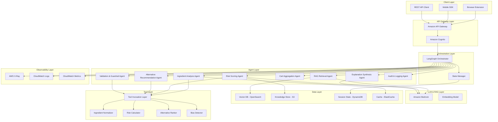
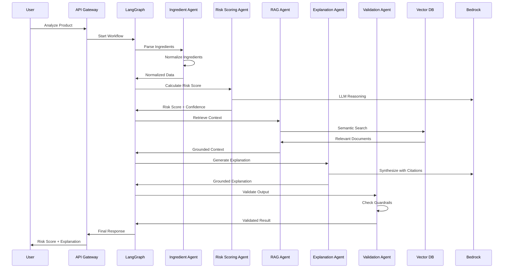

# Design Document: SwasthCart AI

## Overview

SwasthCart AI is a production-ready preventive health intelligence system that integrates with grocery and quick-commerce platforms (e.g., Amazon, Flipkart, BigBasket, Blinkit, Instamart). The system employs a stateful agentic architecture orchestrated by LangGraph, utilizing specialized AI agents, large language models, and retrieval-augmented generation to provide personalized, explainable health risk analysis.

### Core Design Principles

1. **Stateful Agentic Architecture**: Multi-agent system with centralized orchestration
2. **Trust-First Design**: Transparent scoring, source citations, confidence metrics, user control
3. **Safety by Design**: Comprehensive guardrails, no medical diagnosis, clear disclaimers
4. **Production Readiness**: Scalable AWS infrastructure, comprehensive observability, graceful degradation
5. **Data Minimization**: No PHI, no medical records, public datasets only
6. **Responsible AI**: Bias detection, explainability, audit trails, model governance

### System Boundaries

**In Scope:**
- Product risk scoring based on ingredients and nutrition
- Cart-level health assessment
- RAG-grounded explanations with citations
- Alternative product recommendations
- Individual and Family mode scoring
- Browser extension, Mobile SDK, REST API deployment

**Out of Scope:**
- Medical diagnosis or treatment recommendations
- Access to medical records or PHI
- Real-time biometric integration
- Prescription drug interactions
- Clinical decision support

### Deployment Models

1. **Browser Extension (MVP)**: Injects UI overlay into grocery platform pages
2. **Mobile SDK**: Native components for iOS/Android partner integration
3. **REST API**: Enterprise integration for platform backends

## Architecture

### High-Level Architecture



### Architecture Layers

#### 1. Client Layer
- **Browser Extension**: Chrome/Firefox extension injecting UI into grocery sites
- **Mobile SDK**: React Native SDK for iOS/Android integration
- **REST API Client**: HTTP client for enterprise backend integration

#### 2. API Gateway Layer
- **Amazon API Gateway**: REST API endpoints with request validation, throttling, CORS
- **Amazon Cognito**: User authentication, JWT token validation, user pool management

#### 3. Orchestration Layer (LangGraph)
- **LangGraph Orchestrator**: Stateful workflow engine managing agent execution
- **State Manager**: Session state persistence, workflow checkpoints, rollback capability
- **Workflow Definitions**: Declarative agent graphs for different analysis types

#### 4. Agent Layer
Eight specialized agents with defined input/output schemas:
- **Ingredient Analysis Agent**: Parse and normalize ingredient lists
- **Risk Scoring Agent**: Calculate personalized health risk scores
- **RAG Retrieval Agent**: Semantic search in vector database
- **Explanation Synthesis Agent**: Generate grounded explanations
- **Cart Aggregation Agent**: Compute cart-level health scores
- **Alternative Recommendation Agent**: Identify safer alternatives
- **Validation & Guardrail Agent**: Enforce safety constraints
- **Audit & Logging Agent**: Maintain compliance logs

#### 5. LLM & RAG Layer
- **Amazon Bedrock**: Claude 3 for reasoning, structured output generation
- **Embedding Model**: Amazon Titan Embeddings for vector generation

#### 6. Data Layer
- **Vector Database (OpenSearch)**: Embeddings of WHO, FSSAI, USDA guidelines
- **Knowledge Store (S3)**: Structured datasets, risk mappings, sensitivity matrices
- **Session State (DynamoDB)**: User profiles, workflow state, analysis history
- **Cache (ElastiCache)**: Frequently analyzed products, computed risk scores

#### 7. Tool Invocation Layer
- **LangChain + MCP Framework**: Dynamic tool invocation for agents
- **Ingredient Normalizer**: Canonical ingredient name mapping
- **Risk Calculator**: Rule-based risk computation engine
- **Alternative Ranker**: Product similarity and ranking logic
- **Bias Detector**: Brand and price bias detection

#### 8. Observability Layer
- **AWS X-Ray**: Distributed tracing across agents and services
- **CloudWatch Logs**: Structured logging with agent decision paths
- **CloudWatch Metrics**: KPI tracking, performance monitoring, alerting

### Data Flow: Product Risk Analysis



## Components and Interfaces

### 1. LangGraph Orchestration Layer

#### Orchestrator Component

**Responsibilities:**
- Manage stateful multi-step workflows
- Coordinate agent execution order
- Handle retries and fallbacks
- Enforce guardrails at transition points
- Maintain audit trail

**State Schema:**
```json
{
  "session_id": "string",
  "user_id": "string",
  "workflow_type": "product_analysis | cart_analysis",
  "current_step": "string",
  "user_profile": {
    "health_conditions": ["string"],
    "mode": "individual | family",
    "family_profiles": [{"member_id": "string", "conditions": ["string"]}]
  },
  "product_data": {
    "product_id": "string",
    "ingredients": ["string"],
    "nutrition": {}
  },
  "intermediate_results": {},
  "final_output": {},
  "metadata": {
    "start_time": "timestamp",
    "agent_execution_times": {}
  }
}
```

**Workflow Definition (Product Analysis):**
```python
# Pseudocode for LangGraph workflow
workflow = StateGraph()

workflow.add_node("ingredient_analysis", ingredient_analysis_agent)
workflow.add_node("risk_scoring", risk_scoring_agent)
workflow.add_node("rag_retrieval", rag_retrieval_agent)
workflow.add_node("explanation_synthesis", explanation_synthesis_agent)
workflow.add_node("validation", validation_guardrail_agent)
workflow.add_node("audit_logging", audit_logging_agent)

workflow.add_edge("ingredient_analysis", "risk_scoring")
workflow.add_edge("risk_scoring", "rag_retrieval")
workflow.add_edge("rag_retrieval", "explanation_synthesis")
workflow.add_edge("explanation_synthesis", "validation")
workflow.add_edge("validation", "audit_logging")

workflow.set_entry_point("ingredient_analysis")
workflow.set_finish_point("audit_logging")
```

**Retry Strategy:**
- Exponential backoff: 1s, 2s, 4s
- Max retries: 3
- Fallback to rule-based engine if LLM fails

**Interface:**
```python
class LangGraphOrchestrator:
    def execute_workflow(
        self,
        workflow_type: str,
        input_data: dict,
        user_profile: dict
    ) -> dict:
        """
        Execute stateful workflow with agent coordination.
        
        Returns:
            {
                "status": "success | partial | error",
                "result": {},
                "confidence": float,
                "execution_time_ms": int,
                "trace_id": str
            }
        """
        pass
```

### 2. Ingredient Analysis Agent

**Responsibilities:**
- Parse ingredient lists from product metadata
- Normalize ingredient names to canonical forms
- Identify additives, preservatives, artificial ingredients
- Extract nutritional values
- Classify ultra-processed status

**Input Schema:**
```json
{
  "product_id": "string",
  "raw_ingredients": "string",
  "nutrition_facts": {
    "calories": "number",
    "total_fat_g": "number",
    "saturated_fat_g": "number",
    "trans_fat_g": "number",
    "cholesterol_mg": "number",
    "sodium_mg": "number",
    "total_carbs_g": "number",
    "dietary_fiber_g": "number",
    "total_sugars_g": "number",
    "added_sugars_g": "number",
    "protein_g": "number"
  },
  "serving_size": "string"
}
```

**Output Schema:**
```json
{
  "normalized_ingredients": [
    {
      "name": "string",
      "canonical_name": "string",
      "category": "additive | preservative | artificial | natural",
      "e_number": "string | null",
      "confidence": "float"
    }
  ],
  "nutrition_normalized": {},
  "ultra_processed_score": "float (0-1)",
  "parsing_confidence": "float",
  "warnings": ["string"]
}
```

**Tool Invocations:**
- `ingredient_normalizer.normalize(ingredient_name)`: Map to canonical form
- `additive_classifier.classify(ingredient)`: Identify additive type
- `ultra_processed_classifier.score(ingredients, nutrition)`: Compute UPF score

**Implementation Logic:**
1. Tokenize ingredient string by commas and parentheses
2. For each ingredient, query normalization tool
3. Classify ingredient category (additive, preservative, etc.)
4. Extract E-numbers if present
5. Compute ultra-processed score based on NOVA classification
6. Return structured output with confidence scores

### 3. Risk Scoring Agent

**Responsibilities:**
- Calculate personalized health risk scores
- Weight ingredients by user health conditions
- Compute confidence scores
- Support Individual and Family modes

**Input Schema:**
```json
{
  "normalized_ingredients": [],
  "nutrition_normalized": {},
  "ultra_processed_score": "float",
  "user_profile": {
    "health_conditions": ["diabetes", "hypertension"],
    "mode": "individual | family",
    "family_profiles": []
  }
}
```

**Output Schema:**
```json
{
  "risk_score": "float (0-100)",
  "confidence_score": "float (0-1)",
  "risk_factors": [
    {
      "factor": "high_sodium",
      "severity": "high | medium | low",
      "contribution": "float (0-1)"
    }
  ],
  "mode": "individual | family",
  "family_scores": [
    {"member_id": "string", "risk_score": "float"}
  ]
}
```

**Tool Invocations:**
- `risk_calculator.compute_base_risk(ingredients, nutrition)`: Rule-based baseline
- `condition_sensitivity_lookup.query(condition, ingredient)`: Get sensitivity weight
- `confidence_estimator.estimate(data_completeness, model_uncertainty)`: Compute confidence

**Implementation Logic:**
1. Query condition-sensitivity matrix from Knowledge Store
2. For each ingredient, compute weighted risk based on user conditions
3. Aggregate nutritional risk factors (high sodium, high sugar, etc.)
4. Apply ultra-processed penalty
5. If Family mode, compute per-member scores and aggregate
6. Use LLM for complex reasoning if confidence threshold met, else rule-based
7. Compute confidence score based on data completeness
8. Return structured risk assessment

**LLM Prompt Template:**
```
You are a health risk assessment agent. Given the following product data and user health profile, calculate a personalized risk score.

Product Data:
- Ingredients: {ingredients}
- Nutrition: {nutrition}
- Ultra-processed score: {upf_score}

User Profile:
- Health Conditions: {conditions}

Condition Sensitivity Data:
{sensitivity_matrix}

Calculate a risk score (0-100) where:
- 0-30: Low risk
- 31-60: Medium risk
- 61-100: High risk

Return JSON:
{
  "risk_score": <number>,
  "reasoning": "<brief explanation>",
  "key_risk_factors": ["<factor1>", "<factor2>"]
}
```

### 4. RAG Retrieval Agent

**Responsibilities:**
- Perform semantic search in vector database
- Retrieve relevant health guidelines and research
- Compute retrieval confidence scores
- Filter by health condition metadata

**Input Schema:**
```json
{
  "query": "string",
  "health_conditions": ["string"],
  "top_k": "int",
  "filters": {
    "source": ["WHO", "FSSAI", "USDA"],
    "document_type": ["guideline", "research", "labeling_rule"]
  }
}
```

**Output Schema:**
```json
{
  "retrieved_documents": [
    {
      "document_id": "string",
      "content": "string",
      "source": "string",
      "relevance_score": "float",
      "metadata": {}
    }
  ],
  "retrieval_confidence": "float",
  "query_embedding": "array"
}
```

**Tool Invocations:**
- `embedding_model.embed(query)`: Generate query embedding
- `vector_db.similarity_search(embedding, filters, top_k)`: Retrieve documents

**Implementation Logic:**
1. Generate query embedding using Amazon Titan Embeddings
2. Construct OpenSearch query with metadata filters
3. Execute semantic similarity search
4. Rank results by relevance score
5. Compute retrieval confidence based on top result scores
6. Return top-k documents with metadata

**Vector Database Schema (OpenSearch):**
```json
{
  "document_id": "string",
  "content": "string",
  "embedding": "dense_vector (1536 dimensions)",
  "metadata": {
    "source": "WHO | FSSAI | USDA | OpenFoodFacts",
    "document_type": "guideline | research | labeling_rule",
    "health_conditions": ["diabetes", "hypertension"],
    "nutrients": ["sodium", "sugar"],
    "publication_date": "date",
    "citation": "string"
  }
}
```

### 5. Explanation Synthesis Agent

**Responsibilities:**
- Generate human-readable explanations
- Ground explanations in retrieved documents
- Include source citations
- Avoid medical diagnostic language
- Support multi-language output

**Input Schema:**
```json
{
  "risk_score": "float",
  "risk_factors": [],
  "retrieved_documents": [],
  "user_language": "en | hi"
}
```

**Output Schema:**
```json
{
  "explanation": "string",
  "citations": [
    {
      "source": "string",
      "snippet": "string",
      "url": "string"
    }
  ],
  "confidence": "float",
  "language": "string"
}
```

**Tool Invocations:**
- `citation_extractor.extract(document, risk_factor)`: Extract relevant snippets

**Implementation Logic:**
1. Construct prompt with risk factors and retrieved documents
2. Invoke Bedrock LLM with structured output schema
3. Extract citations from generated explanation
4. Validate that explanation is grounded in retrieved documents
5. Translate if user language is not English
6. Return explanation with citations

**LLM Prompt Template:**
```
You are a health explanation agent. Generate a clear, user-friendly explanation for why this product received the given risk score.

Risk Score: {risk_score}/100
Key Risk Factors: {risk_factors}

Reference Documents:
{retrieved_documents}

Guidelines:
- Use simple, non-technical language
- Ground all claims in the reference documents
- Include specific citations
- Avoid medical diagnostic language
- Do not recommend medical treatment
- Focus on ingredient and nutritional concerns

Generate explanation in {language}.

Return JSON:
{
  "explanation": "<explanation text>",
  "citations": [{"source": "<source>", "snippet": "<relevant quote>"}]
}
```

### 6. Cart Aggregation Agent

**Responsibilities:**
- Compute cart-level health score
- Identify high-risk items
- Weight by quantity and serving size
- Track improvement trends

**Input Schema:**
```json
{
  "cart_items": [
    {
      "product_id": "string",
      "risk_score": "float",
      "quantity": "int",
      "serving_size": "string",
      "category": "string"
    }
  ],
  "previous_cart_score": "float | null"
}
```

**Output Schema:**
```json
{
  "cart_health_score": "float (0-100)",
  "high_risk_items": [
    {
      "product_id": "string",
      "risk_score": "float",
      "contribution_to_cart_risk": "float"
    }
  ],
  "trend": "improving | declining | stable",
  "category_breakdown": {
    "snacks": "float",
    "beverages": "float",
    "packaged_foods": "float"
  }
}
```

**Implementation Logic:**
1. Normalize quantities to standard serving sizes
2. Compute weighted average risk score
3. Identify items contributing >15% to total cart risk
4. Compare with previous cart score if available
5. Compute per-category risk breakdown
6. Return aggregated assessment

### 7. Alternative Recommendation Agent

**Responsibilities:**
- Identify safer product alternatives
- Rank by health score improvement
- Consider category, price, availability
- Avoid brand bias

**Input Schema:**
```json
{
  "product_id": "string",
  "risk_score": "float",
  "category": "string",
  "price_range": "string",
  "user_profile": {}
}
```

**Output Schema:**
```json
{
  "alternatives": [
    {
      "product_id": "string",
      "product_name": "string",
      "risk_score": "float",
      "risk_improvement": "float",
      "price_difference": "float",
      "availability": "in_stock | out_of_stock",
      "similarity_score": "float"
    }
  ],
  "bias_check_passed": "boolean"
}
```

**Tool Invocations:**
- `alternative_ranker.rank(product, candidates, user_profile)`: Rank alternatives
- `bias_detector.check(alternatives)`: Detect brand/price bias

**Implementation Logic:**
1. Query product database for same category items
2. Filter by price range (±30% of original)
3. Compute risk scores for candidates
4. Rank by risk improvement and similarity
5. Run bias detection on top-5 alternatives
6. If bias detected, re-rank with bias mitigation
7. Return top-5 alternatives

### 8. Validation & Guardrail Agent

**Responsibilities:**
- Validate agent outputs against safety constraints
- Suppress medical diagnostic claims
- Filter toxic content
- Apply deterministic overrides for unsafe outputs
- Log guardrail trigger events

**Input Schema:**
```json
{
  "agent_output": {},
  "agent_type": "string",
  "validation_rules": ["no_diagnosis", "no_treatment", "no_toxicity"]
}
```

**Output Schema:**
```json
{
  "validation_passed": "boolean",
  "violations": [
    {
      "rule": "string",
      "severity": "critical | warning",
      "message": "string"
    }
  ],
  "sanitized_output": {}
}
```

**Validation Rules:**
1. **No Medical Diagnosis**: Reject outputs containing "diagnose", "disease", "cure", "treat"
2. **No Treatment Recommendations**: Reject outputs recommending medications or therapies
3. **No Toxicity**: Filter offensive, discriminatory, or harmful language
4. **Confidence Threshold**: Flag outputs with confidence <0.5
5. **Citation Requirement**: Ensure explanations include source citations
6. **Disclaimer Presence**: Verify medical disclaimer is included

**Implementation Logic:**
1. Parse agent output
2. Apply regex and keyword filters for prohibited terms
3. Check confidence scores against thresholds
4. Validate citation presence for explanations
5. If critical violation, apply deterministic override (generic safe message)
6. Log all violations to audit trail
7. Return validation result

### 9. Audit & Logging Agent

**Responsibilities:**
- Maintain immutable audit logs
- Log all risk assessments with inputs
- Log RAG retrievals with sources
- Log guardrail trigger events
- Provide audit query interface

**Input Schema:**
```json
{
  "event_type": "risk_assessment | rag_retrieval | guardrail_trigger | alternative_recommendation",
  "session_id": "string",
  "user_id": "string",
  "timestamp": "string",
  "data": {}
}
```

**Output Schema:**
```json
{
  "log_id": "string",
  "status": "logged | failed"
}
```

**Audit Log Schema (DynamoDB):**
```json
{
  "log_id": "string (UUID)",
  "session_id": "string",
  "user_id": "string",
  "timestamp": "string (ISO 8601)",
  "event_type": "string",
  "agent": "string",
  "input_data": {},
  "output_data": {},
  "execution_time_ms": "int",
  "trace_id": "string",
  "metadata": {}
}
```

**Implementation Logic:**
1. Generate unique log_id
2. Serialize event data
3. Write to DynamoDB with TTL (1 year)
4. Write to CloudWatch Logs for searchability
5. Emit CloudWatch metric for event type
6. Return log confirmation

## Data Models

### User Profile Model

```json
{
  "user_id": "string (UUID)",
  "created_at": "timestamp",
  "updated_at": "timestamp",
  "preferences": {
    "mode": "individual | family",
    "language": "en | hi",
    "swasth_mode_enabled": "boolean"
  },
  "health_profile": {
    "conditions": [
      {
        "condition_id": "string",
        "condition_name": "diabetes | pre-diabetes | hypertension | thyroid | pcos | cardiovascular | mental_health",
        "declared_at": "timestamp"
      }
    ]
  },
  "family_profiles": [
    {
      "member_id": "string (UUID)",
      "relationship": "string",
      "conditions": ["string"]
    }
  ],
  "privacy": {
    "data_retention_days": "int",
    "audit_log_access": "boolean"
  }
}
```

### Product Model

```json
{
  "product_id": "string",
  "platform": "string",
  "name": "string",
  "brand": "string",
  "category": "string",
  "raw_ingredients": "string",
  "nutrition_facts": {},
  "serving_size": "string",
  "price": "float",
  "availability": "in_stock | out_of_stock",
  "metadata": {
    "barcode": "string",
    "image_url": "string",
    "last_updated": "timestamp"
  }
}
```

### Risk Assessment Model

```json
{
  "assessment_id": "string (UUID)",
  "session_id": "string",
  "user_id": "string",
  "product_id": "string",
  "timestamp": "timestamp",
  "risk_score": "float (0-100)",
  "confidence_score": "float (0-1)",
  "mode": "individual | family",
  "risk_factors": [
    {
      "factor": "string",
      "severity": "high | medium | low",
      "contribution": "float"
    }
  ],
  "explanation": {
    "text": "string",
    "citations": []
  },
  "alternatives": [],
  "metadata": {
    "execution_time_ms": "int",
    "trace_id": "string",
    "model_version": "string"
  }
}
```

### Cart Assessment Model

```json
{
  "cart_id": "string (UUID)",
  "user_id": "string",
  "timestamp": "timestamp",
  "cart_health_score": "float (0-100)",
  "items": [
    {
      "product_id": "string",
      "risk_score": "float",
      "quantity": "int"
    }
  ],
  "high_risk_items": [],
  "trend": "improving | declining | stable",
  "previous_cart_score": "float | null"
}
```

### Knowledge Store Models

**Condition-Sensitivity Matrix:**
```json
{
  "condition": "diabetes",
  "sensitivities": [
    {
      "ingredient_canonical": "added_sugar",
      "sensitivity_weight": "float (0-1)",
      "evidence_level": "high | medium | low",
      "sources": ["WHO_guideline_2015", "FSSAI_standard_2020"]
    }
  ]
}
```

**Ingredient Risk Mapping:**
```json
{
  "ingredient_canonical": "sodium_benzoate",
  "risk_category": "preservative",
  "e_number": "E211",
  "base_risk_score": "float (0-100)",
  "condition_modifiers": {
    "hypertension": "float (multiplier)"
  },
  "sources": ["FSSAI_additive_list", "EFSA_opinion_2016"]
}
```

**Ultra-Processed Classification:**
```json
{
  "nova_group": "4",
  "indicators": [
    "contains_artificial_sweeteners",
    "contains_emulsifiers",
    "contains_flavor_enhancers",
    "high_ingredient_count"
  ],
  "risk_penalty": "float (0-30)"
}
```

