# SwasthCart AI - Architecture & Workflow Diagrams

## Document Control

| Version | Date | Author | Status |
|---------|------|--------|--------|
| 1.0 | 2026-02-14 | System Architecture Team | Draft |

---

## Table of Contents

1. [System Architecture Diagrams](#1-system-architecture-diagrams)
2. [Workflow Diagrams](#2-workflow-diagrams)
3. [Data Flow Diagrams](#3-data-flow-diagrams)
4. [Deployment Architecture](#4-deployment-architecture)
5. [Agent Interaction Diagrams](#5-agent-interaction-diagrams)

---

## 1. System Architecture Diagrams

### 1.1 High-Level System Architecture

```mermaid
graph TB
    subgraph "Client Layer"
        BE[Browser Extension<br/>Chrome/Firefox]
        MS[Mobile SDK<br/>iOS/Android]
        API[REST API Client<br/>Enterprise Integration]
    end
    
    subgraph "API Gateway Layer"
        APIGW[Amazon API Gateway<br/>REST + WebSocket]
        AUTH[Amazon Cognito<br/>Authentication]
    end
    
    subgraph "Orchestration Layer - LangGraph"
        LG[LangGraph Orchestrator<br/>Stateful Workflow Engine]
        SM[State Manager<br/>Session Persistence]
    end
    
    subgraph "Agent Layer - Specialized Agents"
        IA[Ingredient Analysis Agent<br/>Parse & Normalize]
        RS[Risk Scoring Agent<br/>Personalized Scoring]
        RAG[RAG Retrieval Agent<br/>Semantic Search]
        ES[Explanation Synthesis Agent<br/>Grounded Explanations]
        CA[Cart Aggregation Agent<br/>Cart Health Score]
        AR[Alternative Recommendation Agent<br/>Safer Options]
        VG[Validation & Guardrail Agent<br/>Safety Checks]
        AL[Audit & Logging Agent<br/>Compliance Logs]
    end
    
    subgraph "LLM & RAG Layer"
        BEDROCK[Amazon Bedrock<br/>Claude 3 Sonnet/Haiku]
        EMBED[Amazon Titan Embeddings<br/>Vector Generation]
    end
    
    subgraph "Data Layer"
        VDB[Vector Database<br/>Amazon OpenSearch]
        KS[Knowledge Store<br/>Amazon S3]
        DDB[Session State<br/>Amazon DynamoDB]
        CACHE[Cache Layer<br/>Amazon ElastiCache]
    end
    
    subgraph "Tool Invocation Layer - LangChain + MCP"
        NORM[Ingredient Normalizer]
        CALC[Risk Calculator]
        RANK[Alternative Ranker]
        BIAS[Bias Detector]
        CONF[Confidence Estimator]
    end
    
    subgraph "Observability Layer"
        XRAY[AWS X-Ray<br/>Distributed Tracing]
        CW[CloudWatch Logs<br/>Structured Logging]
        METRICS[CloudWatch Metrics<br/>KPI Tracking]
    end
    
    %% Client to Gateway
    BE --> APIGW
    MS --> APIGW
    API --> APIGW
    
    %% Gateway to Orchestration
    APIGW --> AUTH
    AUTH --> LG
    LG <--> SM
    
    %% Orchestration to Agents
    LG --> IA
    LG --> RS
    LG --> RAG
    LG --> ES
    LG --> CA
    LG --> AR
    LG --> VG
    LG --> AL
    
    %% Agents to Tools
    IA --> NORM
    RS --> CALC
    AR --> RANK
    VG --> BIAS
    RS --> CONF
    
    %% Agents to LLM/RAG
    RS --> BEDROCK
    ES --> BEDROCK
    RAG --> EMBED
    RAG --> VDB
    
    %% Agents to Data
    SM --> DDB
    IA --> CACHE
    RS --> KS
    CA --> DDB
    AL --> DDB
    
    %% Observability
    LG --> XRAY
    LG --> CW
    LG --> METRICS
    
    style LG fill:#ff9999
    style BEDROCK fill:#99ccff
    style VDB fill:#99ff99
    style XRAY fill:#ffcc99
```

### 1.2 Layered Architecture View

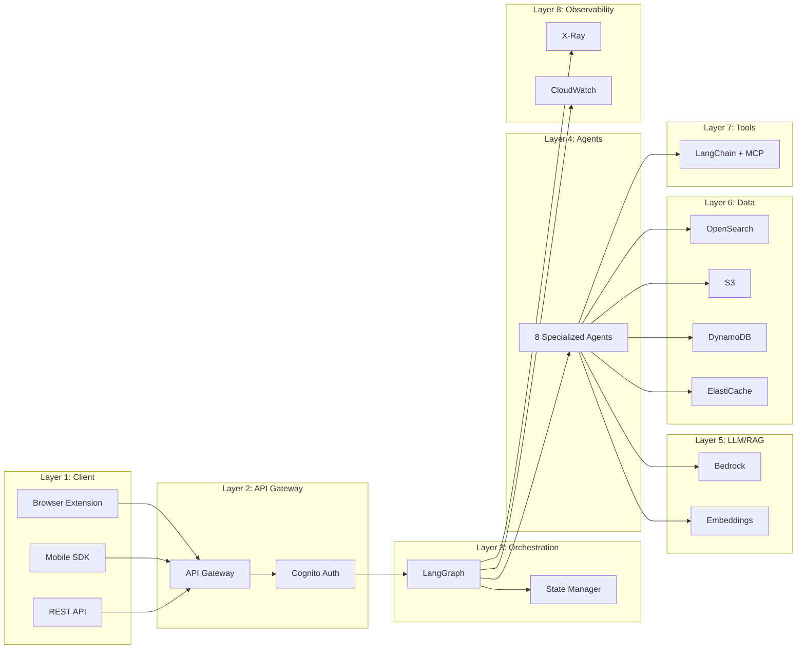
```mermaid
graph LR
    subgraph "Layer 1: Client"
        C1[Browser Extension]
        C2[Mobile SDK]
        C3[REST API]
    end
    
    subgraph "Layer 2: API Gateway"
        G1[API Gateway]
        G2[Cognito Auth]
    end
    
    subgraph "Layer 3: Orchestration"
        O1[LangGraph]
        O2[State Manager]
    end
    
    subgraph "Layer 4: Agents"
        A1[8 Specialized Agents]
    end
    
    subgraph "Layer 5: LLM/RAG"
        L1[Bedrock]
        L2[Embeddings]
    end
    
    subgraph "Layer 6: Data"
        D1[OpenSearch]
        D2[S3]
        D3[DynamoDB]
        D4[ElastiCache]
    end
    
    subgraph "Layer 7: Tools"
        T1[LangChain + MCP]
    end
    
    subgraph "Layer 8: Observability"
        OB1[X-Ray]
        OB2[CloudWatch]
    end
    
    C1 --> G1
    C2 --> G1
    C3 --> G1
    G1 --> G2
    G2 --> O1
    O1 --> O2
    O1 --> A1
    A1 --> L1
    A1 --> L2
    A1 --> D1
    A1 --> D2
    A1 --> D3
    A1 --> D4
    A1 --> T1
    O1 --> OB1
    O1 --> OB2
```

---

## 2. Workflow Diagrams

### 2.1 Product Risk Analysis Workflow

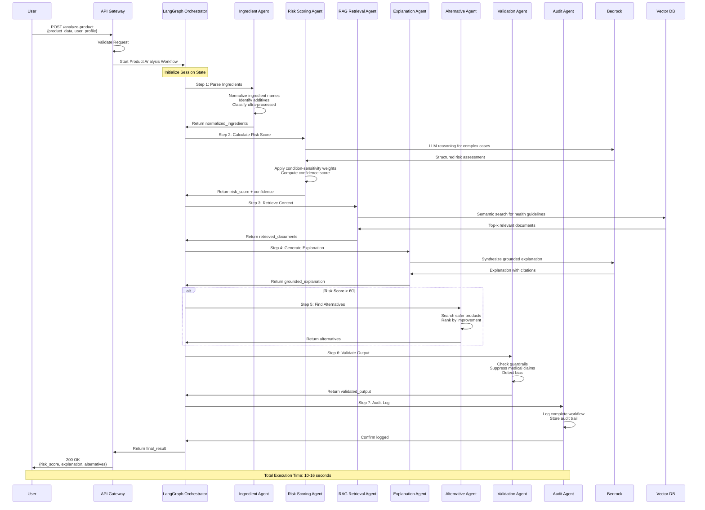
```mermaid
sequenceDiagram
    participant User
    participant API as API Gateway
    participant LG as LangGraph Orchestrator
    participant IA as Ingredient Agent
    participant RS as Risk Scoring Agent
    participant RAG as RAG Retrieval Agent
    participant ES as Explanation Agent
    participant AR as Alternative Agent
    participant VG as Validation Agent
    participant AL as Audit Agent
    participant Bedrock
    participant VDB as Vector DB
    
    User->>API: POST /analyze-product<br/>{product_data, user_profile}
    API->>API: Validate Request
    API->>LG: Start Product Analysis Workflow
    
    Note over LG: Initialize Session State
    
    LG->>IA: Step 1: Parse Ingredients
    IA->>IA: Normalize ingredient names<br/>Identify additives<br/>Classify ultra-processed
    IA->>LG: Return normalized_ingredients
    
    LG->>RS: Step 2: Calculate Risk Score
    RS->>Bedrock: LLM reasoning for complex cases
    Bedrock->>RS: Structured risk assessment
    RS->>RS: Apply condition-sensitivity weights<br/>Compute confidence score
    RS->>LG: Return risk_score + confidence
    
    LG->>RAG: Step 3: Retrieve Context
    RAG->>VDB: Semantic search for health guidelines
    VDB->>RAG: Top-k relevant documents
    RAG->>LG: Return retrieved_documents
    
    LG->>ES: Step 4: Generate Explanation
    ES->>Bedrock: Synthesize grounded explanation
    Bedrock->>ES: Explanation with citations
    ES->>LG: Return grounded_explanation
    
    alt Risk Score > 60
        LG->>AR: Step 5: Find Alternatives
        AR->>AR: Search safer products<br/>Rank by improvement
        AR->>LG: Return alternatives
    end
    
    LG->>VG: Step 6: Validate Output
    VG->>VG: Check guardrails<br/>Suppress medical claims<br/>Detect bias
    VG->>LG: Return validated_output
    
    LG->>AL: Step 7: Audit Log
    AL->>AL: Log complete workflow<br/>Store audit trail
    AL->>LG: Confirm logged
    
    LG->>API: Return final_result
    API->>User: 200 OK<br/>{risk_score, explanation, alternatives}
    
    Note over User,AL: Total Execution Time: 10-16 seconds
```

### 2.2 Cart Analysis Workflow

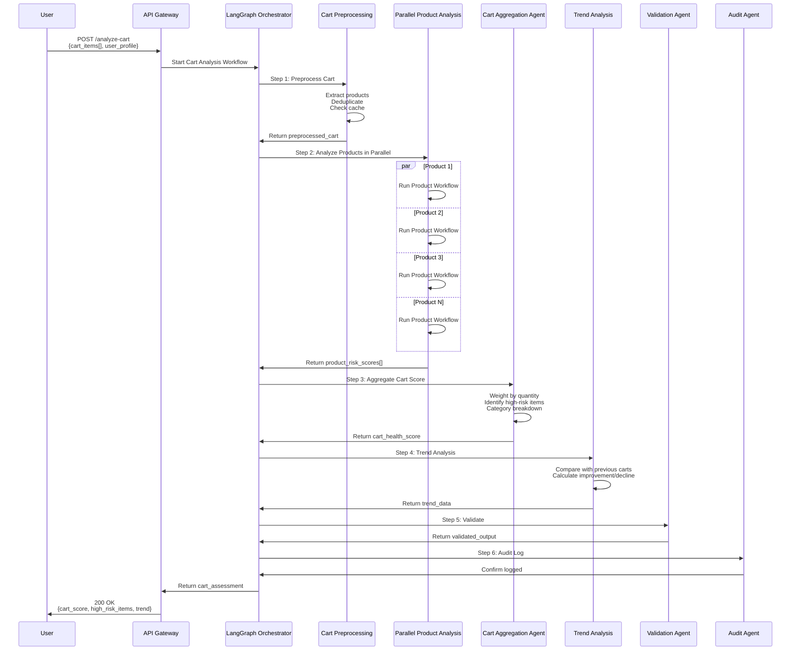
```mermaid
sequenceDiagram
    participant User
    participant API as API Gateway
    participant LG as LangGraph Orchestrator
    participant CP as Cart Preprocessing
    participant PA as Parallel Product Analysis
    participant CA as Cart Aggregation Agent
    participant TA as Trend Analysis
    participant VG as Validation Agent
    participant AL as Audit Agent
    
    User->>API: POST /analyze-cart<br/>{cart_items[], user_profile}
    API->>LG: Start Cart Analysis Workflow
    
    LG->>CP: Step 1: Preprocess Cart
    CP->>CP: Extract products<br/>Deduplicate<br/>Check cache
    CP->>LG: Return preprocessed_cart
    
    LG->>PA: Step 2: Analyze Products in Parallel
    
    par Product 1
        PA->>PA: Run Product Workflow
    and Product 2
        PA->>PA: Run Product Workflow
    and Product 3
        PA->>PA: Run Product Workflow
    and Product N
        PA->>PA: Run Product Workflow
    end
    
    PA->>LG: Return product_risk_scores[]
    
    LG->>CA: Step 3: Aggregate Cart Score
    CA->>CA: Weight by quantity<br/>Identify high-risk items<br/>Category breakdown
    CA->>LG: Return cart_health_score
    
    LG->>TA: Step 4: Trend Analysis
    TA->>TA: Compare with previous carts<br/>Calculate improvement/decline
    TA->>LG: Return trend_data
    
    LG->>VG: Step 5: Validate
    VG->>LG: Return validated_output
    
    LG->>AL: Step 6: Audit Log
    AL->>LG: Confirm logged
    
    LG->>API: Return cart_assessment
    API->>User: 200 OK<br/>{cart_score, high_risk_items, trend}
```

### 2.3 LangGraph State Machine Workflow

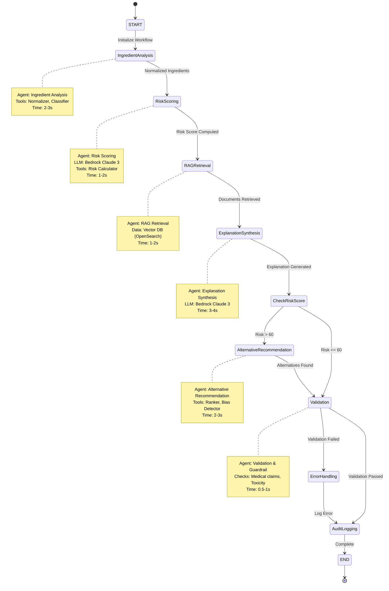
```mermaid
stateDiagram-v2
    [*] --> START
    START --> IngredientAnalysis: Initialize Workflow
    
    IngredientAnalysis --> RiskScoring: Normalized Ingredients
    
    RiskScoring --> RAGRetrieval: Risk Score Computed
    
    RAGRetrieval --> ExplanationSynthesis: Documents Retrieved
    
    ExplanationSynthesis --> CheckRiskScore: Explanation Generated
    
    CheckRiskScore --> AlternativeRecommendation: Risk > 60
    CheckRiskScore --> Validation: Risk <= 60
    
    AlternativeRecommendation --> Validation: Alternatives Found
    
    Validation --> AuditLogging: Validation Passed
    Validation --> ErrorHandling: Validation Failed
    
    ErrorHandling --> AuditLogging: Log Error
    
    AuditLogging --> END: Complete
    
    END --> [*]
    
    note right of IngredientAnalysis
        Agent: Ingredient Analysis
        Tools: Normalizer, Classifier
        Time: 2-3s
    end note
    
    note right of RiskScoring
        Agent: Risk Scoring
        LLM: Bedrock Claude 3
        Tools: Risk Calculator
        Time: 1-2s
    end note
    
    note right of RAGRetrieval
        Agent: RAG Retrieval
        Data: Vector DB (OpenSearch)
        Time: 1-2s
    end note
    
    note right of ExplanationSynthesis
        Agent: Explanation Synthesis
        LLM: Bedrock Claude 3
        Time: 3-4s
    end note
    
    note right of AlternativeRecommendation
        Agent: Alternative Recommendation
        Tools: Ranker, Bias Detector
        Time: 2-3s
    end note
    
    note right of Validation
        Agent: Validation & Guardrail
        Checks: Medical claims, Toxicity
        Time: 0.5-1s
    end note
```

---

## 3. Data Flow Diagrams

### 3.1 Product Data Flow

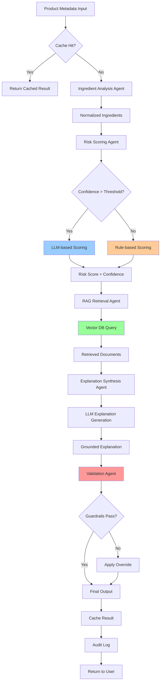
```mermaid
flowchart TD
    A[Product Metadata Input] --> B{Cache Hit?}
    B -->|Yes| C[Return Cached Result]
    B -->|No| D[Ingredient Analysis Agent]
    
    D --> E[Normalized Ingredients]
    E --> F[Risk Scoring Agent]
    
    F --> G{Confidence > Threshold?}
    G -->|Yes| H[LLM-based Scoring]
    G -->|No| I[Rule-based Scoring]
    
    H --> J[Risk Score + Confidence]
    I --> J
    
    J --> K[RAG Retrieval Agent]
    K --> L[Vector DB Query]
    L --> M[Retrieved Documents]
    
    M --> N[Explanation Synthesis Agent]
    N --> O[LLM Explanation Generation]
    O --> P[Grounded Explanation]
    
    P --> Q[Validation Agent]
    Q --> R{Guardrails Pass?}
    R -->|Yes| S[Final Output]
    R -->|No| T[Apply Override]
    T --> S
    
    S --> U[Cache Result]
    U --> V[Audit Log]
    V --> W[Return to User]
    
    style H fill:#99ccff
    style I fill:#ffcc99
    style L fill:#99ff99
    style Q fill:#ff9999
```

### 3.2 RAG System Data Flow

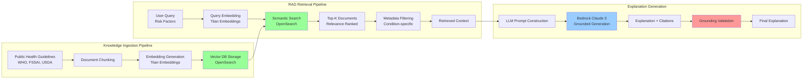
```mermaid
flowchart LR
    subgraph "Knowledge Ingestion Pipeline"
        A[Public Health Guidelines<br/>WHO, FSSAI, USDA] --> B[Document Chunking]
        B --> C[Embedding Generation<br/>Titan Embeddings]
        C --> D[Vector DB Storage<br/>OpenSearch]
    end
    
    subgraph "RAG Retrieval Pipeline"
        E[User Query<br/>Risk Factors] --> F[Query Embedding<br/>Titan Embeddings]
        F --> G[Semantic Search<br/>OpenSearch]
        D --> G
        G --> H[Top-K Documents<br/>Relevance Ranked]
        H --> I[Metadata Filtering<br/>Condition-specific]
        I --> J[Retrieved Context]
    end
    
    subgraph "Explanation Generation"
        J --> K[LLM Prompt Construction]
        K --> L[Bedrock Claude 3<br/>Grounded Generation]
        L --> M[Explanation + Citations]
        M --> N[Grounding Validation]
        N --> O[Final Explanation]
    end
    
    style D fill:#99ff99
    style G fill:#99ff99
    style L fill:#99ccff
    style N fill:#ff9999
```

### 3.3 User Profile & Session State Flow

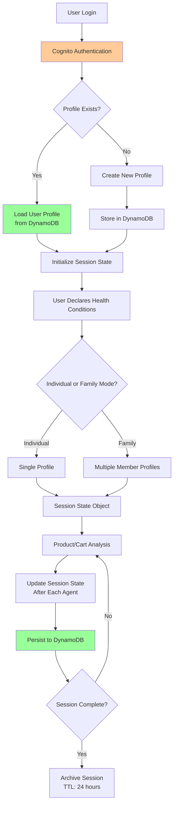
```mermaid
flowchart TD
    A[User Login] --> B[Cognito Authentication]
    B --> C{Profile Exists?}
    C -->|Yes| D[Load User Profile<br/>from DynamoDB]
    C -->|No| E[Create New Profile]
    
    E --> F[Store in DynamoDB]
    D --> G[Initialize Session State]
    F --> G
    
    G --> H[User Declares Health Conditions]
    H --> I{Individual or Family Mode?}
    I -->|Individual| J[Single Profile]
    I -->|Family| K[Multiple Member Profiles]
    
    J --> L[Session State Object]
    K --> L
    
    L --> M[Product/Cart Analysis]
    M --> N[Update Session State<br/>After Each Agent]
    N --> O[Persist to DynamoDB]
    
    O --> P{Session Complete?}
    P -->|No| M
    P -->|Yes| Q[Archive Session<br/>TTL: 24 hours]
    
    style B fill:#ffcc99
    style D fill:#99ff99
    style O fill:#99ff99
```

---

## 4. Deployment Architecture

### 4.1 AWS Infrastructure Deployment

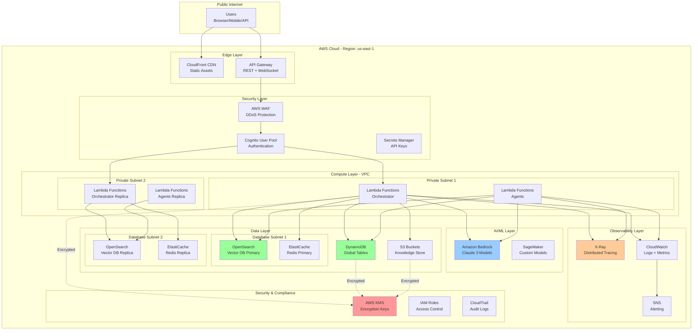
```mermaid
graph TB
    subgraph "Public Internet"
        USER[Users<br/>Browser/Mobile/API]
    end
    
    subgraph "AWS Cloud - Region: us-east-1"
        subgraph "Edge Layer"
            CF[CloudFront CDN<br/>Static Assets]
            APIGW[API Gateway<br/>REST + WebSocket]
        end
        
        subgraph "Security Layer"
            WAF[AWS WAF<br/>DDoS Protection]
            COGNITO[Cognito User Pool<br/>Authentication]
            SECRETS[Secrets Manager<br/>API Keys]
        end
        
        subgraph "Compute Layer - VPC"
            subgraph "Private Subnet 1"
                LAMBDA1[Lambda Functions<br/>Orchestrator]
                LAMBDA2[Lambda Functions<br/>Agents]
            end
            
            subgraph "Private Subnet 2"
                LAMBDA3[Lambda Functions<br/>Orchestrator Replica]
                LAMBDA4[Lambda Functions<br/>Agents Replica]
            end
        end
        
        subgraph "AI/ML Layer"
            BEDROCK[Amazon Bedrock<br/>Claude 3 Models]
            SAGEMAKER[SageMaker<br/>Custom Models]
        end
        
        subgraph "Data Layer"
            subgraph "Database Subnet 1"
                OPENSEARCH1[OpenSearch<br/>Vector DB Primary]
                ELASTICACHE1[ElastiCache<br/>Redis Primary]
            end
            
            subgraph "Database Subnet 2"
                OPENSEARCH2[OpenSearch<br/>Vector DB Replica]
                ELASTICACHE2[ElastiCache<br/>Redis Replica]
            end
            
            DDB[DynamoDB<br/>Global Tables]
            S3[S3 Buckets<br/>Knowledge Store]
        end
        
        subgraph "Observability Layer"
            XRAY[X-Ray<br/>Distributed Tracing]
            CW[CloudWatch<br/>Logs + Metrics]
            SNS[SNS<br/>Alerting]
        end
        
        subgraph "Security & Compliance"
            KMS[AWS KMS<br/>Encryption Keys]
            IAM[IAM Roles<br/>Access Control]
            CLOUDTRAIL[CloudTrail<br/>Audit Logs]
        end
    end
    
    USER --> CF
    USER --> APIGW
    APIGW --> WAF
    WAF --> COGNITO
    COGNITO --> LAMBDA1
    COGNITO --> LAMBDA3
    
    LAMBDA1 --> BEDROCK
    LAMBDA2 --> BEDROCK
    LAMBDA1 --> OPENSEARCH1
    LAMBDA2 --> OPENSEARCH1
    LAMBDA3 --> OPENSEARCH2
    LAMBDA4 --> OPENSEARCH2
    
    LAMBDA1 --> ELASTICACHE1
    LAMBDA3 --> ELASTICACHE2
    LAMBDA1 --> DDB
    LAMBDA2 --> DDB
    LAMBDA1 --> S3
    
    LAMBDA1 --> XRAY
    LAMBDA2 --> XRAY
    LAMBDA1 --> CW
    LAMBDA2 --> CW
    
    CW --> SNS
    
    LAMBDA1 -.->|Encrypted| KMS
    DDB -.->|Encrypted| KMS
    S3 -.->|Encrypted| KMS
    
    style BEDROCK fill:#99ccff
    style OPENSEARCH1 fill:#99ff99
    style DDB fill:#99ff99
    style XRAY fill:#ffcc99
    style KMS fill:#ff9999
```

### 4.2 Multi-Region Deployment (Future)

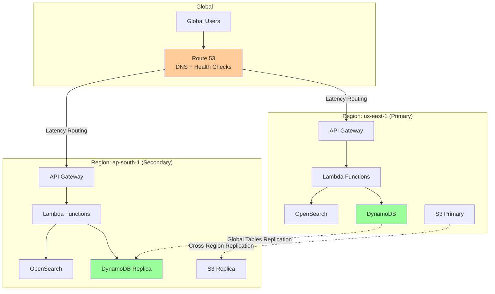
```mermaid
graph TB
    subgraph "Global"
        R53[Route 53<br/>DNS + Health Checks]
        USERS[Global Users]
    end
    
    subgraph "Region: us-east-1 (Primary)"
        US_APIGW[API Gateway]
        US_LAMBDA[Lambda Functions]
        US_OPENSEARCH[OpenSearch]
        US_DDB[DynamoDB]
        US_S3[S3 Primary]
    end
    
    subgraph "Region: ap-south-1 (Secondary)"
        IN_APIGW[API Gateway]
        IN_LAMBDA[Lambda Functions]
        IN_OPENSEARCH[OpenSearch]
        IN_DDB[DynamoDB Replica]
        IN_S3[S3 Replica]
    end
    
    USERS --> R53
    R53 -->|Latency Routing| US_APIGW
    R53 -->|Latency Routing| IN_APIGW
    
    US_APIGW --> US_LAMBDA
    IN_APIGW --> IN_LAMBDA
    
    US_LAMBDA --> US_OPENSEARCH
    IN_LAMBDA --> IN_OPENSEARCH
    
    US_LAMBDA --> US_DDB
    IN_LAMBDA --> IN_DDB
    
    US_DDB -.->|Global Tables Replication| IN_DDB
    US_S3 -.->|Cross-Region Replication| IN_S3
    
    style R53 fill:#ffcc99
    style US_DDB fill:#99ff99
    style IN_DDB fill:#99ff99
```

---

## 5. Agent Interaction Diagrams

### 5.1 Agent Communication Pattern

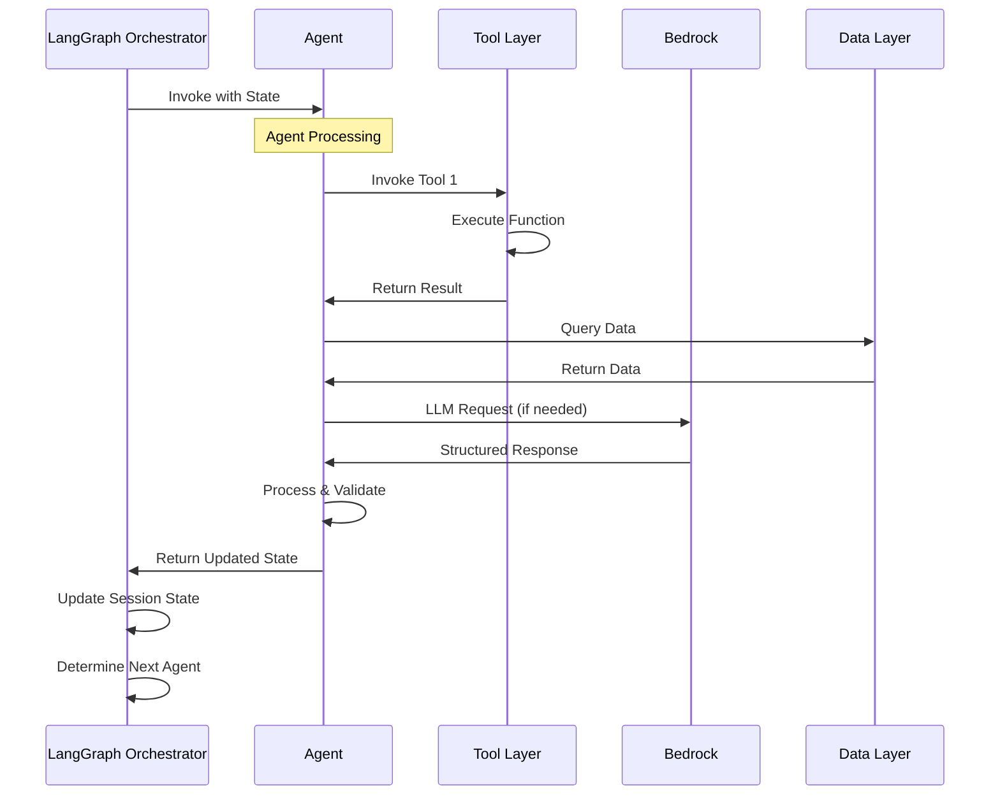
```mermaid
sequenceDiagram
    participant LG as LangGraph Orchestrator
    participant Agent
    participant Tools as Tool Layer
    participant LLM as Bedrock
    participant Data as Data Layer
    
    LG->>Agent: Invoke with State
    
    Note over Agent: Agent Processing
    
    Agent->>Tools: Invoke Tool 1
    Tools->>Tools: Execute Function
    Tools->>Agent: Return Result
    
    Agent->>Data: Query Data
    Data->>Agent: Return Data
    
    Agent->>LLM: LLM Request (if needed)
    LLM->>Agent: Structured Response
    
    Agent->>Agent: Process & Validate
    
    Agent->>LG: Return Updated State
    
    LG->>LG: Update Session State
    LG->>LG: Determine Next Agent
```

### 5.2 Tool Invocation Pattern (LangChain + MCP)

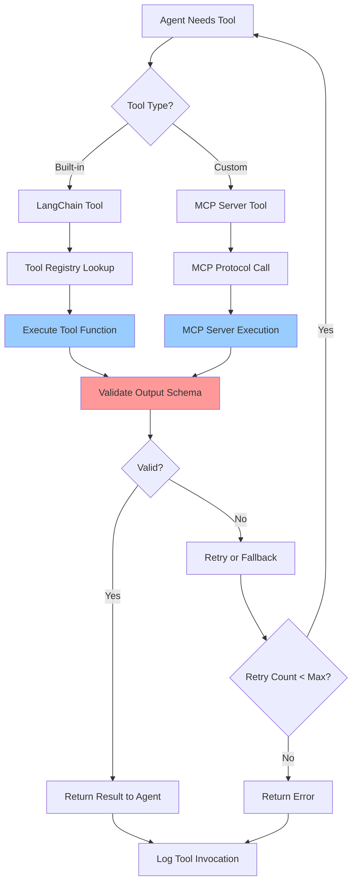
```mermaid
flowchart TD
    A[Agent Needs Tool] --> B{Tool Type?}
    
    B -->|Built-in| C[LangChain Tool]
    B -->|Custom| D[MCP Server Tool]
    
    C --> E[Tool Registry Lookup]
    D --> F[MCP Protocol Call]
    
    E --> G[Execute Tool Function]
    F --> H[MCP Server Execution]
    
    G --> I[Validate Output Schema]
    H --> I
    
    I --> J{Valid?}
    J -->|Yes| K[Return Result to Agent]
    J -->|No| L[Retry or Fallback]
    
    L --> M{Retry Count < Max?}
    M -->|Yes| A
    M -->|No| N[Return Error]
    
    K --> O[Log Tool Invocation]
    N --> O
    
    style G fill:#99ccff
    style H fill:#99ccff
    style I fill:#ff9999
```

### 5.3 Guardrail Enforcement Flow

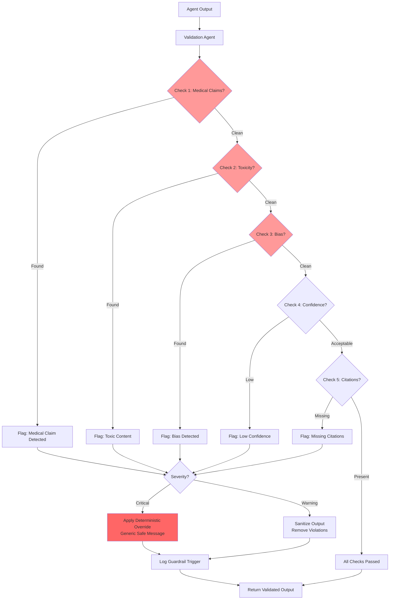
```mermaid
flowchart TD
    A[Agent Output] --> B[Validation Agent]
    
    B --> C{Check 1: Medical Claims?}
    C -->|Found| D[Flag: Medical Claim Detected]
    C -->|Clean| E{Check 2: Toxicity?}
    
    E -->|Found| F[Flag: Toxic Content]
    E -->|Clean| G{Check 3: Bias?}
    
    G -->|Found| H[Flag: Bias Detected]
    G -->|Clean| I{Check 4: Confidence?}
    
    I -->|Low| J[Flag: Low Confidence]
    I -->|Acceptable| K{Check 5: Citations?}
    
    K -->|Missing| L[Flag: Missing Citations]
    K -->|Present| M[All Checks Passed]
    
    D --> N{Severity?}
    F --> N
    H --> N
    J --> N
    L --> N
    
    N -->|Critical| O[Apply Deterministic Override<br/>Generic Safe Message]
    N -->|Warning| P[Sanitize Output<br/>Remove Violations]
    
    M --> Q[Return Validated Output]
    O --> R[Log Guardrail Trigger]
    P --> R
    
    R --> Q
    
    style C fill:#ff9999
    style E fill:#ff9999
    style G fill:#ff9999
    style O fill:#ff6666
```

### 5.4 Retry and Fallback Strategy

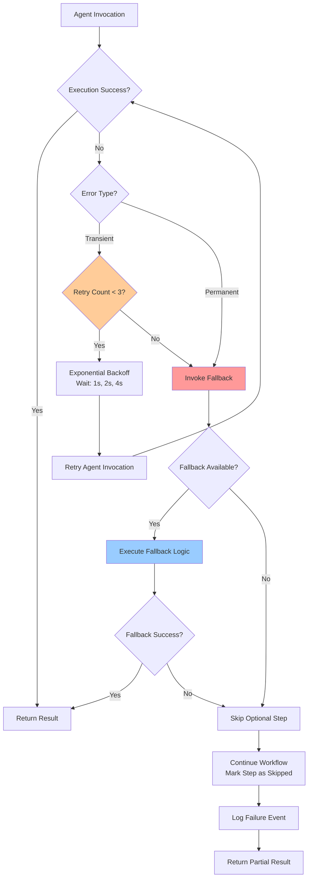
```mermaid
flowchart TD
    A[Agent Invocation] --> B{Execution Success?}
    
    B -->|Yes| C[Return Result]
    B -->|No| D{Error Type?}
    
    D -->|Transient| E{Retry Count < 3?}
    D -->|Permanent| F[Invoke Fallback]
    
    E -->|Yes| G[Exponential Backoff<br/>Wait: 1s, 2s, 4s]
    E -->|No| F
    
    G --> H[Retry Agent Invocation]
    H --> B
    
    F --> I{Fallback Available?}
    I -->|Yes| J[Execute Fallback Logic]
    I -->|No| K[Skip Optional Step]
    
    J --> L{Fallback Success?}
    L -->|Yes| C
    L -->|No| K
    
    K --> M[Continue Workflow<br/>Mark Step as Skipped]
    M --> N[Log Failure Event]
    N --> O[Return Partial Result]
    
    style E fill:#ffcc99
    style F fill:#ff9999
    style J fill:#99ccff
```

---

## 6. Security Architecture

### 6.1 Security Layers and Controls

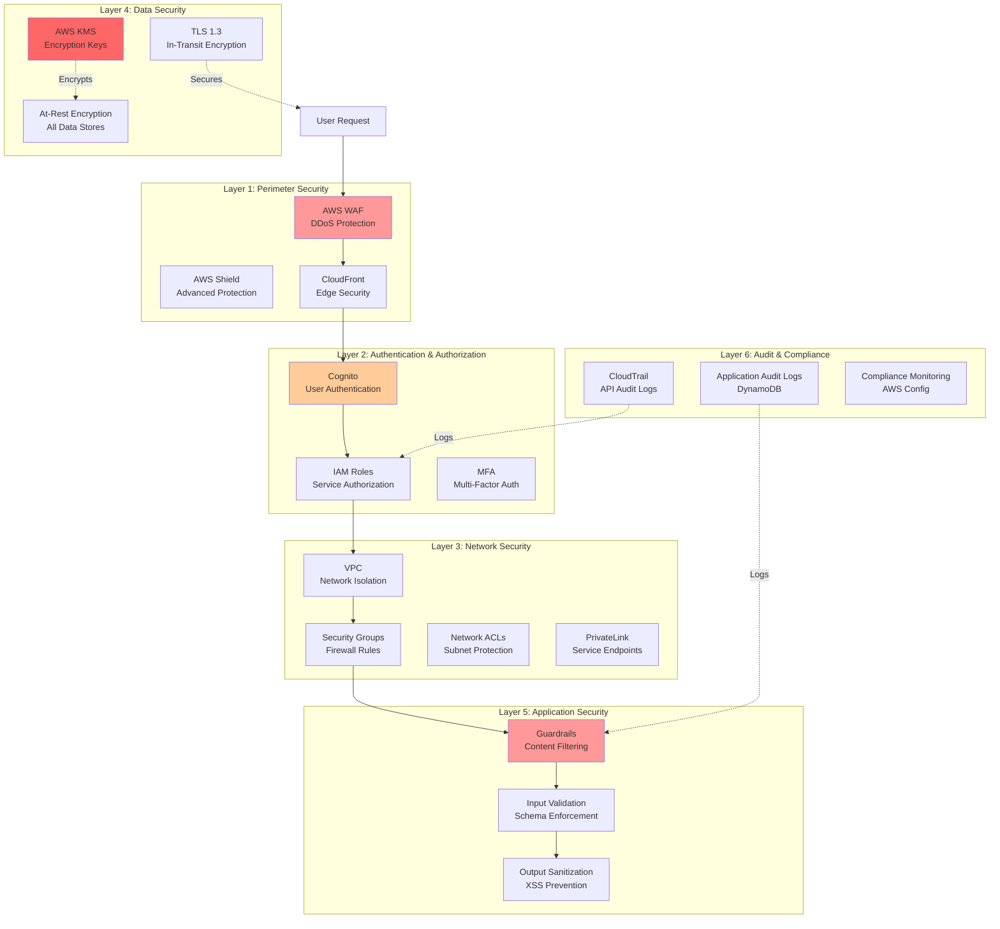
```mermaid
graph TB
    subgraph "Layer 1: Perimeter Security"
        WAF[AWS WAF<br/>DDoS Protection]
        SHIELD[AWS Shield<br/>Advanced Protection]
        CF[CloudFront<br/>Edge Security]
    end
    
    subgraph "Layer 2: Authentication & Authorization"
        COGNITO[Cognito<br/>User Authentication]
        IAM[IAM Roles<br/>Service Authorization]
        MFA[MFA<br/>Multi-Factor Auth]
    end
    
    subgraph "Layer 3: Network Security"
        VPC[VPC<br/>Network Isolation]
        SG[Security Groups<br/>Firewall Rules]
        NACL[Network ACLs<br/>Subnet Protection]
        PRIVATELINK[PrivateLink<br/>Service Endpoints]
    end
    
    subgraph "Layer 4: Data Security"
        KMS[AWS KMS<br/>Encryption Keys]
        TLS[TLS 1.3<br/>In-Transit Encryption]
        ENCRYPT[At-Rest Encryption<br/>All Data Stores]
    end
    
    subgraph "Layer 5: Application Security"
        GUARDRAILS[Guardrails<br/>Content Filtering]
        VALIDATION[Input Validation<br/>Schema Enforcement]
        SANITIZATION[Output Sanitization<br/>XSS Prevention]
    end
    
    subgraph "Layer 6: Audit & Compliance"
        CLOUDTRAIL[CloudTrail<br/>API Audit Logs]
        AUDITLOG[Application Audit Logs<br/>DynamoDB]
        COMPLIANCE[Compliance Monitoring<br/>AWS Config]
    end
    
    USER[User Request] --> WAF
    WAF --> CF
    CF --> COGNITO
    COGNITO --> IAM
    IAM --> VPC
    VPC --> SG
    SG --> GUARDRAILS
    GUARDRAILS --> VALIDATION
    
    VALIDATION --> SANITIZATION
    
    KMS -.->|Encrypts| ENCRYPT
    TLS -.->|Secures| USER
    
    CLOUDTRAIL -.->|Logs| IAM
    AUDITLOG -.->|Logs| GUARDRAILS
    
    style WAF fill:#ff9999
    style COGNITO fill:#ffcc99
    style KMS fill:#ff6666
    style GUARDRAILS fill:#ff9999
```

### 6.2 Data Privacy Flow

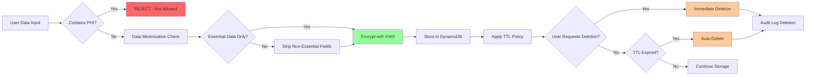
```mermaid
flowchart LR
    A[User Data Input] --> B{Contains PHI?}
    B -->|Yes| C[REJECT - Not Allowed]
    B -->|No| D[Data Minimization Check]
    
    D --> E{Essential Data Only?}
    E -->|No| F[Strip Non-Essential Fields]
    E -->|Yes| G[Encrypt with KMS]
    F --> G
    
    G --> H[Store in DynamoDB]
    H --> I[Apply TTL Policy]
    
    I --> J{User Requests Deletion?}
    J -->|Yes| K[Immediate Deletion]
    J -->|No| L{TTL Expired?}
    
    L -->|Yes| M[Auto-Delete]
    L -->|No| N[Continue Storage]
    
    K --> O[Audit Log Deletion]
    M --> O
    
    style C fill:#ff6666
    style G fill:#99ff99
    style K fill:#ffcc99
    style M fill:#ffcc99
```

---

## 7. Observability & Monitoring

### 7.1 Observability Stack

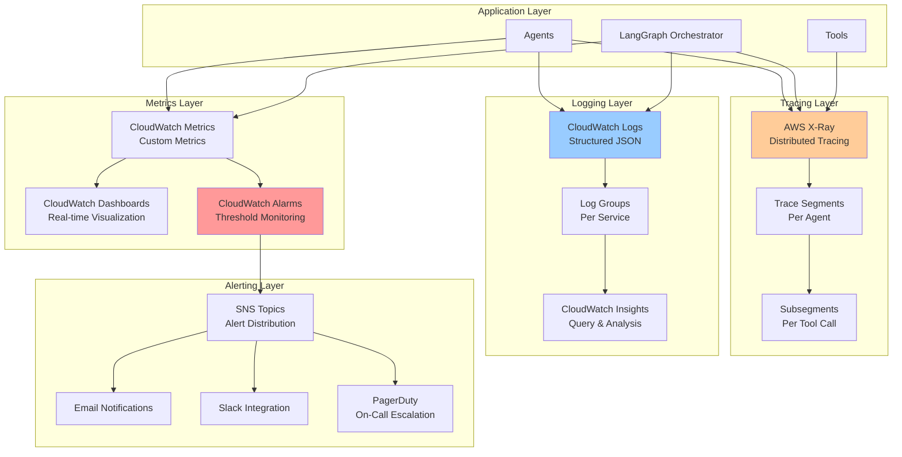
```mermaid
graph TB
    subgraph "Application Layer"
        AGENTS[Agents]
        ORCHESTRATOR[LangGraph Orchestrator]
        TOOLS[Tools]
    end
    
    subgraph "Tracing Layer"
        XRAY[AWS X-Ray<br/>Distributed Tracing]
        SEGMENTS[Trace Segments<br/>Per Agent]
        SUBSEGMENTS[Subsegments<br/>Per Tool Call]
    end
    
    subgraph "Logging Layer"
        CW_LOGS[CloudWatch Logs<br/>Structured JSON]
        LOG_GROUPS[Log Groups<br/>Per Service]
        LOG_INSIGHTS[CloudWatch Insights<br/>Query & Analysis]
    end
    
    subgraph "Metrics Layer"
        CW_METRICS[CloudWatch Metrics<br/>Custom Metrics]
        DASHBOARDS[CloudWatch Dashboards<br/>Real-time Visualization]
        ALARMS[CloudWatch Alarms<br/>Threshold Monitoring]
    end
    
    subgraph "Alerting Layer"
        SNS[SNS Topics<br/>Alert Distribution]
        EMAIL[Email Notifications]
        SLACK[Slack Integration]
        PAGERDUTY[PagerDuty<br/>On-Call Escalation]
    end
    
    AGENTS --> XRAY
    ORCHESTRATOR --> XRAY
    TOOLS --> XRAY
    
    XRAY --> SEGMENTS
    SEGMENTS --> SUBSEGMENTS
    
    AGENTS --> CW_LOGS
    ORCHESTRATOR --> CW_LOGS
    CW_LOGS --> LOG_GROUPS
    LOG_GROUPS --> LOG_INSIGHTS
    
    AGENTS --> CW_METRICS
    ORCHESTRATOR --> CW_METRICS
    CW_METRICS --> DASHBOARDS
    CW_METRICS --> ALARMS
    
    ALARMS --> SNS
    SNS --> EMAIL
    SNS --> SLACK
    SNS --> PAGERDUTY
    
    style XRAY fill:#ffcc99
    style CW_LOGS fill:#99ccff
    style ALARMS fill:#ff9999
```

### 7.2 Metrics Dashboard Layout

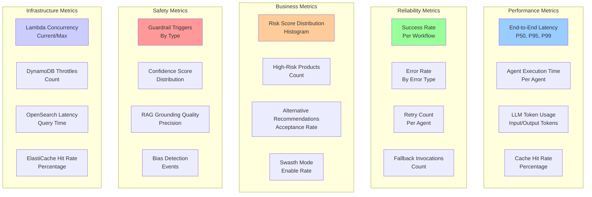
```mermaid
graph TB
    subgraph "Performance Metrics"
        P1[End-to-End Latency<br/>P50, P95, P99]
        P2[Agent Execution Time<br/>Per Agent]
        P3[LLM Token Usage<br/>Input/Output Tokens]
        P4[Cache Hit Rate<br/>Percentage]
    end
    
    subgraph "Reliability Metrics"
        R1[Success Rate<br/>Per Workflow]
        R2[Error Rate<br/>By Error Type]
        R3[Retry Count<br/>Per Agent]
        R4[Fallback Invocations<br/>Count]
    end
    
    subgraph "Business Metrics"
        B1[Risk Score Distribution<br/>Histogram]
        B2[High-Risk Products<br/>Count]
        B3[Alternative Recommendations<br/>Acceptance Rate]
        B4[Swasth Mode<br/>Enable Rate]
    end
    
    subgraph "Safety Metrics"
        S1[Guardrail Triggers<br/>By Type]
        S2[Confidence Score<br/>Distribution]
        S3[RAG Grounding Quality<br/>Precision]
        S4[Bias Detection<br/>Events]
    end
    
    subgraph "Infrastructure Metrics"
        I1[Lambda Concurrency<br/>Current/Max]
        I2[DynamoDB Throttles<br/>Count]
        I3[OpenSearch Latency<br/>Query Time]
        I4[ElastiCache Hit Rate<br/>Percentage]
    end
    
    style P1 fill:#99ccff
    style R1 fill:#99ff99
    style B1 fill:#ffcc99
    style S1 fill:#ff9999
    style I1 fill:#ccccff
```

---

## 8. Integration Patterns

### 8.1 Browser Extension Integration

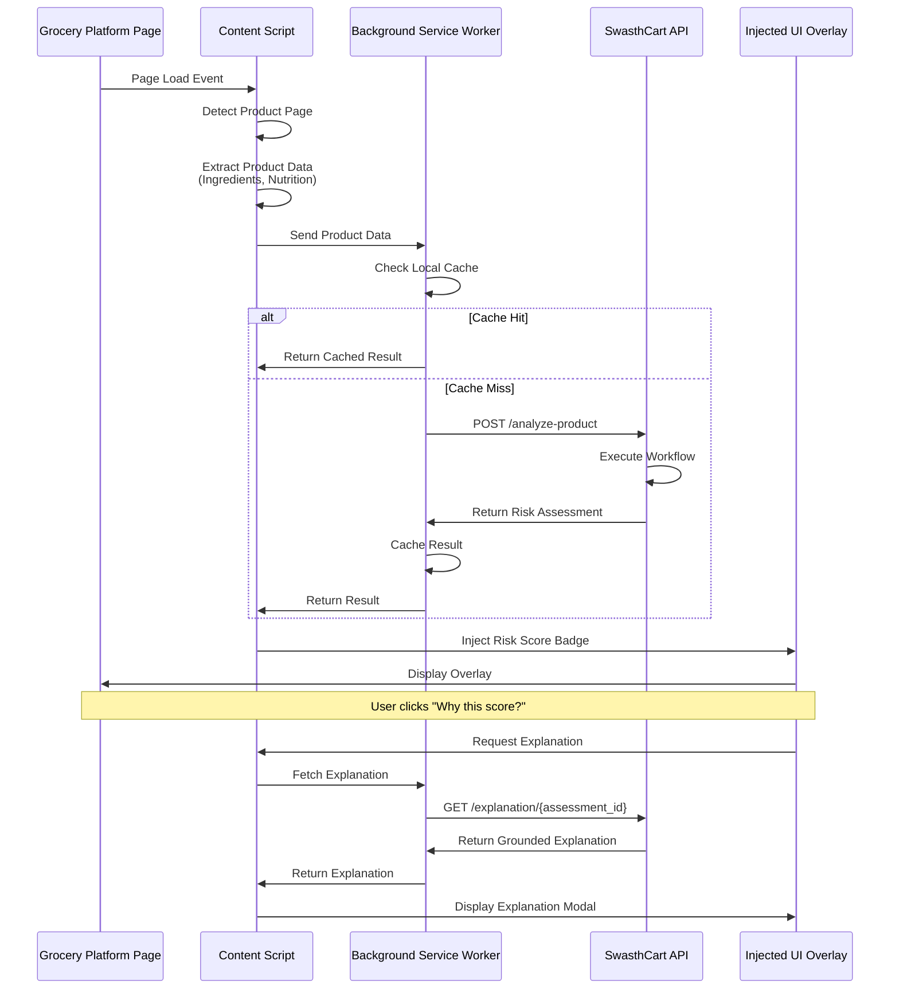
```mermaid
sequenceDiagram
    participant Page as Grocery Platform Page
    participant CS as Content Script
    participant BG as Background Service Worker
    participant API as SwasthCart API
    participant UI as Injected UI Overlay
    
    Page->>CS: Page Load Event
    CS->>CS: Detect Product Page
    CS->>CS: Extract Product Data<br/>(Ingredients, Nutrition)
    
    CS->>BG: Send Product Data
    BG->>BG: Check Local Cache
    
    alt Cache Hit
        BG->>CS: Return Cached Result
    else Cache Miss
        BG->>API: POST /analyze-product
        API->>API: Execute Workflow
        API->>BG: Return Risk Assessment
        BG->>BG: Cache Result
        BG->>CS: Return Result
    end
    
    CS->>UI: Inject Risk Score Badge
    UI->>Page: Display Overlay
    
    Note over Page,UI: User clicks "Why this score?"
    
    UI->>CS: Request Explanation
    CS->>BG: Fetch Explanation
    BG->>API: GET /explanation/{assessment_id}
    API->>BG: Return Grounded Explanation
    BG->>CS: Return Explanation
    CS->>UI: Display Explanation Modal
```

### 8.2 Mobile SDK Integration

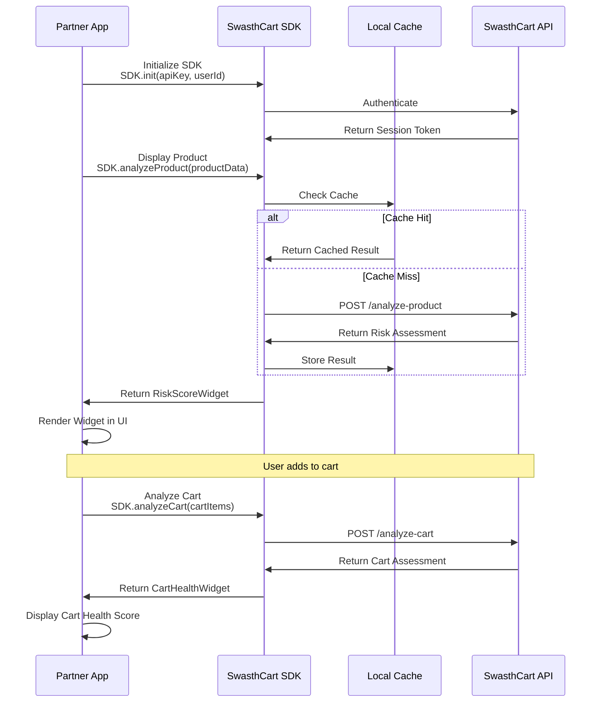
```mermaid
sequenceDiagram
    participant App as Partner App
    participant SDK as SwasthCart SDK
    participant Cache as Local Cache
    participant API as SwasthCart API
    
    App->>SDK: Initialize SDK<br/>SDK.init(apiKey, userId)
    SDK->>API: Authenticate
    API->>SDK: Return Session Token
    
    App->>SDK: Display Product<br/>SDK.analyzeProduct(productData)
    SDK->>Cache: Check Cache
    
    alt Cache Hit
        Cache->>SDK: Return Cached Result
    else Cache Miss
        SDK->>API: POST /analyze-product
        API->>SDK: Return Risk Assessment
        SDK->>Cache: Store Result
    end
    
    SDK->>App: Return RiskScoreWidget
    App->>App: Render Widget in UI
    
    Note over App,API: User adds to cart
    
    App->>SDK: Analyze Cart<br/>SDK.analyzeCart(cartItems)
    SDK->>API: POST /analyze-cart
    API->>SDK: Return Cart Assessment
    SDK->>App: Return CartHealthWidget
    App->>App: Display Cart Health Score
```

### 8.3 REST API Integration (Enterprise)

```mermaid
sequenceDiagram
    participant Backend as Partner Backend
    participant API as SwasthCart API
    participant Webhook as Partner Webhook
    
    Backend->>API: POST /auth/token<br/>{client_id, client_secret}
    API->>Backend: Return JWT Token
    
    Backend->>API: POST /analyze-product<br/>Authorization: Bearer {token}
    API->>API: Validate Token
    API->>API: Execute Workflow (Async)
    API->>Backend: 202 Accepted<br/>{job_id}
    
    Note over API: Processing...
    
    API->>Webhook: POST /webhook/analysis-complete<br/>{job_id, result}
    Webhook->>Backend: Store Result
    Webhook->>API: 200 OK
    
    alt Polling Alternative
        Backend->>API: GET /jobs/{job_id}
        API->>Backend: Return Status & Result
    end
```

---

## 9. Scalability Patterns

### 9.1 Horizontal Scaling Strategy

```mermaid
graph TB
    subgraph "Load Distribution"
        ALB[Application Load Balancer]
        APIGW[API Gateway<br/>Auto-scaling]
    end
    
    subgraph "Compute Scaling"
        LAMBDA1[Lambda Instance 1<br/>Orchestrator]
        LAMBDA2[Lambda Instance 2<br/>Orchestrator]
        LAMBDA3[Lambda Instance N<br/>Orchestrator]
        
        AGENT1[Lambda Instance 1<br/>Agents]
        AGENT2[Lambda Instance 2<br/>Agents]
        AGENT3[Lambda Instance N<br/>Agents]
    end
    
    subgraph "Data Scaling"
        OPENSEARCH[OpenSearch<br/>3 Primary Shards<br/>1 Replica per Shard]
        DDB[DynamoDB<br/>On-Demand Scaling]
        ELASTICACHE[ElastiCache<br/>Cluster Mode]
    end
    
    subgraph "Concurrency Control"
        THROTTLE[API Gateway Throttling<br/>1000 req/s per user]
        LAMBDA_CONCURRENCY[Lambda Reserved Concurrency<br/>500 concurrent executions]
        DDB_CAPACITY[DynamoDB Auto-scaling<br/>Target Utilization: 70%]
    end
    
    ALB --> APIGW
    APIGW --> LAMBDA1
    APIGW --> LAMBDA2
    APIGW --> LAMBDA3
    
    LAMBDA1 --> AGENT1
    LAMBDA2 --> AGENT2
    LAMBDA3 --> AGENT3
    
    AGENT1 --> OPENSEARCH
    AGENT2 --> OPENSEARCH
    AGENT3 --> OPENSEARCH
    
    AGENT1 --> DDB
    AGENT2 --> DDB
    AGENT3 --> DDB
    
    AGENT1 --> ELASTICACHE
    AGENT2 --> ELASTICACHE
    AGENT3 --> ELASTICACHE
    
    APIGW -.-> THROTTLE
    LAMBDA1 -.-> LAMBDA_CONCURRENCY
    DDB -.-> DDB_CAPACITY
    
    style OPENSEARCH fill:#99ff99
    style DDB fill:#99ff99
    style THROTTLE fill:#ff9999
```

### 9.2 Caching Strategy

```mermaid
flowchart TD
    A[Request: Analyze Product] --> B{Check L1 Cache<br/>ElastiCache}
    
    B -->|Hit| C[Return Cached Result<br/>TTL: 24h]
    B -->|Miss| D{Check L2 Cache<br/>DynamoDB}
    
    D -->|Hit| E[Return from DynamoDB<br/>Update L1 Cache]
    D -->|Miss| F[Execute Full Workflow]
    
    F --> G[Compute Risk Score]
    G --> H[Store in DynamoDB<br/>TTL: 7 days]
    H --> I[Store in ElastiCache<br/>TTL: 24h]
    I --> J[Return Result]
    
    E --> I
    
    K{Cache Invalidation Event?} -->|Knowledge Store Updated| L[Invalidate All Caches]
    K -->|Model Updated| L
    K -->|Manual Trigger| L
    
    L --> M[Clear ElastiCache]
    L --> N[Clear DynamoDB Cache]
    
    style B fill:#99ccff
    style D fill:#99ccff
    style L fill:#ff9999
```

---

## 10. Error Handling & Recovery

### 10.1 Error Handling Flow

```mermaid
flowchart TD
    A[Error Occurs] --> B{Error Category?}
    
    B -->|Transient| C[Retry with Backoff]
    B -->|Validation| D[Return 400 Bad Request]
    B -->|Authentication| E[Return 401 Unauthorized]
    B -->|Authorization| F[Return 403 Forbidden]
    B -->|Not Found| G[Return 404 Not Found]
    B -->|Rate Limit| H[Return 429 Too Many Requests]
    B -->|Server Error| I[Invoke Fallback]
    
    C --> J{Retry Success?}
    J -->|Yes| K[Continue Workflow]
    J -->|No| I
    
    I --> L{Fallback Available?}
    L -->|Yes| M[Execute Fallback Logic]
    L -->|No| N[Graceful Degradation]
    
    M --> O{Fallback Success?}
    O -->|Yes| P[Return Partial Result]
    O -->|No| N
    
    N --> Q[Return 503 Service Unavailable<br/>with Retry-After Header]
    
    D --> R[Log Error]
    E --> R
    F --> R
    G --> R
    H --> R
    P --> R
    Q --> R
    
    R --> S[Emit CloudWatch Metric]
    S --> T[Check Alarm Threshold]
    
    T --> U{Threshold Exceeded?}
    U -->|Yes| V[Trigger SNS Alert]
    U -->|No| W[Continue Monitoring]
    
    style C fill:#ffcc99
    style I fill:#ff9999
    style M fill:#99ccff
    style V fill:#ff6666
```

---

## 11. Model Lifecycle & Governance

### 11.1 Model Deployment Pipeline

```mermaid
flowchart LR
    A[Model Development] --> B[Offline Evaluation]
    B --> C{Metrics Pass?}
    C -->|No| A
    C -->|Yes| D[Model Registry<br/>Version: v1.2.3]
    
    D --> E[Staging Deployment]
    E --> F[Integration Tests]
    F --> G{Tests Pass?}
    G -->|No| H[Rollback]
    G -->|Yes| I[Canary Deployment<br/>5% Traffic]
    
    I --> J[Monitor Metrics<br/>24 hours]
    J --> K{Metrics Healthy?}
    K -->|No| H
    K -->|Yes| L[Gradual Rollout<br/>25% → 50% → 100%]
    
    L --> M[Full Production]
    M --> N[Continuous Monitoring]
    N --> O{Drift Detected?}
    O -->|Yes| P[Alert & Investigate]
    O -->|No| N
    
    H --> Q[Restore Previous Version]
    Q --> R[Post-Mortem Analysis]
    
    style C fill:#ffcc99
    style K fill:#ffcc99
    style O fill:#ff9999
    style H fill:#ff6666
```

### 11.2 A/B Testing Framework

```mermaid
graph TB
    subgraph "Traffic Routing"
        USER[User Request] --> ROUTER[A/B Router]
        ROUTER -->|50%| VARIANT_A[Variant A<br/>Current Model]
        ROUTER -->|50%| VARIANT_B[Variant B<br/>New Model]
    end
    
    subgraph "Variant A Processing"
        VARIANT_A --> WORKFLOW_A[Workflow Execution]
        WORKFLOW_A --> RESULT_A[Result A]
    end
    
    subgraph "Variant B Processing"
        VARIANT_B --> WORKFLOW_B[Workflow Execution]
        WORKFLOW_B --> RESULT_B[Result B]
    end
    
    subgraph "Metrics Collection"
        RESULT_A --> METRICS_A[Collect Metrics A]
        RESULT_B --> METRICS_B[Collect Metrics B]
    end
    
    subgraph "Analysis"
        METRICS_A --> COMPARE[Statistical Comparison]
        METRICS_B --> COMPARE
        COMPARE --> DECISION{Variant B Better?}
        DECISION -->|Yes| PROMOTE[Promote to 100%]
        DECISION -->|No| ROLLBACK[Rollback to A]
        DECISION -->|Inconclusive| EXTEND[Extend Test Duration]
    end
    
    style ROUTER fill:#ffcc99
    style COMPARE fill:#99ccff
    style DECISION fill:#ff9999
```

---

## 12. Disaster Recovery

### 12.1 Backup and Recovery Strategy

```mermaid
flowchart TD
    subgraph "Backup Strategy"
        A[Production Data] --> B[DynamoDB Point-in-Time Recovery<br/>Continuous Backups]
        A --> C[S3 Versioning<br/>Knowledge Store]
        A --> D[OpenSearch Snapshots<br/>Daily to S3]
    end
    
    subgraph "Disaster Scenarios"
        E[Region Failure] --> F{Multi-Region Enabled?}
        F -->|Yes| G[Automatic Failover<br/>Route 53 Health Checks]
        F -->|No| H[Manual Failover<br/>RTO: 4 hours]
        
        I[Data Corruption] --> J[Restore from Backup<br/>RPO: 5 minutes]
        
        K[Service Outage] --> L[Graceful Degradation<br/>Cached Results Only]
    end
    
    subgraph "Recovery Process"
        G --> M[Verify Secondary Region]
        H --> N[Deploy to Secondary Region]
        J --> O[Validate Data Integrity]
        L --> P[Monitor Service Recovery]
        
        M --> Q[Resume Operations]
        N --> Q
        O --> Q
        P --> Q
    end
    
    style E fill:#ff6666
    style I fill:#ff6666
    style K fill:#ff6666
    style Q fill:#99ff99
```

---

## 13. Summary

This document provides comprehensive architectural and workflow diagrams for the SwasthCart AI system, covering:

1. **System Architecture**: High-level and layered views of the complete system
2. **Workflows**: Product analysis, cart analysis, and LangGraph state machines
3. **Data Flows**: Product data, RAG system, and user profile management
4. **Deployment**: AWS infrastructure and multi-region architecture
5. **Agent Interactions**: Communication patterns, tool invocation, and guardrails
6. **Security**: Multi-layer security architecture and data privacy flows
7. **Observability**: Tracing, logging, metrics, and alerting
8. **Integration**: Browser extension, mobile SDK, and REST API patterns
9. **Scalability**: Horizontal scaling and caching strategies
10. **Error Handling**: Comprehensive error handling and recovery flows
11. **Model Lifecycle**: Deployment pipeline and A/B testing
12. **Disaster Recovery**: Backup and recovery strategies

These diagrams serve as the visual reference for understanding the system's architecture, data flows, and operational patterns.

---

**Document Version**: 1.0  
**Last Updated**: 2026-02-14  
**Status**: Draft
